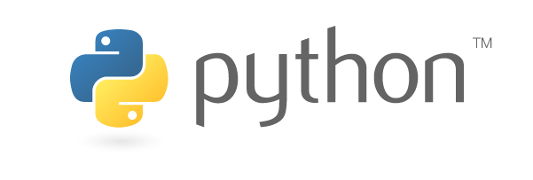
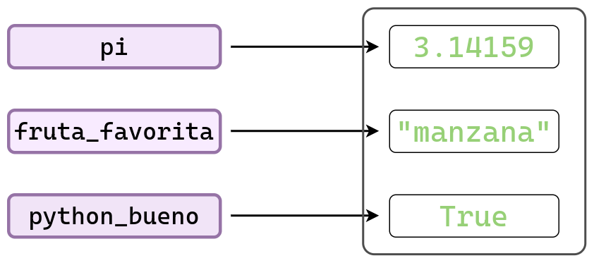
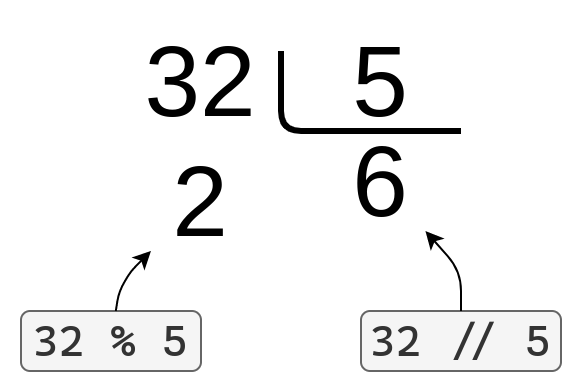

## ¿Qué es Python?

### Introducción

{fig-align="center" width="500px"}

Python es un lenguaje de programación **interpretado**, de **propósito general** y de **alto nivel**.
Fue creado por Guido Van Rossum y su primera versión pública fue en el año 1991.

* **Interpretado**: no requiere que realicemos un paso explícito de compilación a lenguaje de máquina antes de ejecutarlo. Además, se puede ejecutar línea por línea.
* **Propósito general**: no se limita a un tipo de aplicación específica, es decir, se puede usar para implementar programas en diferentes dominios:
    * _Vox populi_: No es el mejor en casi nada, pero suficientemente bueno para casi todo.
    * Algunos dominios:
        * Análisis estadístico y ciencia de datos.
        * Inteligencia artificial.
        * Desarrollo web.
        * Desarrollo de videojuegos.
        * _Scripting_.
* **Alto nivel**: se parece más al lenguaje humano que al lenguaje de las máquinas.

Además...

* Es **gratis**: no requiere pagar licencias para usarlo, tanto a nivel personal como comercial.
* Es de **código abierto**: su código fuente está disponible públicamente y puede ser modificado por cualquiera.
* Posee un **ecosistema de librerías completísimo**: existen miles de paquetes para todo tipo de tareas.
* **Comunidad**: millones de personas lo usan, contribuyen, resuelven dudas y crean contenido, lo que facilita aprender y encontrar ayuda.

Para utilizar Python es necesario instalar un intérprete de Python. La versión oficial puede ser descargada desde [python.org](https://www.python.org/). Una vez instalado el intérprete, es posible ejecutar _scripts_ de Python y programar en Python de manera interactiva desde la terminal.

En esta materia se utiliza un editor de código para ciencia de datos llamado [Positron](https://positron.posit.co/). Este editor es desarrollado por Posit, los mismos creadores de RStudio, y permite trabajar tanto con Python como con R.

Las instrucciones para instalar Python y Positron pueden ser encontradas en [Instalación de Python y Positron en Windows](../../recursos/tutoriales/instalacion_python.qmd).

### Primeros pasos: Python como una calculadora

Empecemos utilizando a Python como si fuese una calculadora.

```python
>>> 2 * 3
6
```

```python
>>> 100 / 3.5
```

```python
>>> 20 + 5
25
```

```python
>>> 13 - 3
10
```

```python
>>> 10 * 5.5
55.0
```

## Tipos de datos

Como cualquier lenguaje de programación, Python ofrece diferentes **tipos de datos**.

Cada tipo de dato nos ayuda a resolver una tarea distinta. Por ejemplo, si quiero hacer operaciones matemáticas voy a necesitar de números, pero si quiero escribir un correo electrónico voy a necesitar de texto.

A continuación vamos a introducir los tipos de datos más básicos que Python nos ofrece.
Más adelante también veremos otros tipos de datos más complejos que nos van a permitir resolver problemas (muchísimo) más interesantes.

### Números

Acabamos de hacer cuentas matemáticas somo si tuvieramos una calculadora. Para eso usamos números, los conocidos de toda la vida.

Sin notarlo, utilizamos dos tipos de números distintos: los números de tipo entero (`int`) y los números de tipo flotante (`float`).

Lo siguiente es un número entero:

```python
>>> 50
50
```

Y el siguiente es un ejemplo de un número flotante:

```python
>>> 36.8
36.8
```

Utilizando la función `type()` Python nos devuelve el tipo del objeto.

```python
>>> type(10)
<class 'int'>
```

```python
>>> type(10.5)
<class 'float'>
```

```python
>>> type(10.0)
<class 'float'>
```

```python
>>> type(10.)
<class 'float'>
```

::: {.callout-note}
### Observación 👀

A diferencia de R, Python no es un lenguaje vectorizado. Por lo tanto, los tipos `int` y `float` representan valores **escalares**, no vectores de longitud 1 como ocurre en R.

Esta observación aplica a todos los tipos de datos elementales que vienen a continuación.
:::

### Cadenas de texto

Para ser una lenguaje de programación tan afamado, Python tiene que ser capaz de trabajar con objetos más complejos que los números.

Un ejemplo de esto es el texto, que se representa con un objeto llamado **cadena de texto** y se construyen utilizando comillas.

Como en la mayoría de los lenguajes de programación, las comillas se ponen al principio y al final del texto e indican el principio y el final de la cadena; estas pueden pueden ser dobles `"` o simples `'`.

```python
>>> "Programando en Python"
'Programando en Python'
```

```python
>>> 'Con comillas simples, también.'
'Con comillas simples, también.'
```

En Python no hay diferencia entre usar comillas simples `'` o dobles `"`, pero es importante que el tipo de comilla que se usa para abrir la cadena sea el mismo que se usa para cerrarla.

Cuando imprimimos una cadena, las comillas no se muestran en la salida. Para imprimir cualquier objeto de Python utilizamos la función `print()`.

```python
>>> print('Con comillas simples, ¡también!')
Con comillas simples, ¡también!
```

Una forma un poco más exótica, pero muy útil, de crear cadenas es utilizando **comillas triples**. Con esta sintaxis, se repiten tres comillas seguidas, lo que permite definir cadenas de texto que ocupan varias líneas.

```python
>>> print("""Se puede escribir texto
... en varias lineas.
... ¡Está muy bueno!""")
Se puede escribir texto
en varias lineas.
¡Está muy bueno!
```

Otra manera de escribir texto que abarca múltiples líneas es usando el carácter especial `\n`, que representa un salto de línea.

```python
>>> print("Primera línea\nsegunda línea\ntercera línea.")
Primera línea
segunda línea
tercera línea.
```

En cambio, si mostramos una representación del texto (sin usar `print()`), los `\n` sí se visualizan.

```python
>>> "Primera línea\nsegunda línea\ntercera línea."
'Primera línea\nsegunda línea\ntercera línea.'
```

::: {.callout-tip}
### ¡Atención! 🤓

¿Cuál es la diferencia entre usar `print()` y no usarlo?

* Cuando usamos `print()` se imprime el objeto de una manera humanamente legible.
* Cuando no lo usamos, se muestra una **representación** del objeto. Esta representación tiene que ser lo menos ambigua posible.
    * Por este motivo es que se muestran las comillas a la hora de representar una cadena.
:::

Otra situación en la que usar `print()` genera una diferencia es cuando se quieren mostrar varios
objetos al ejecutar un bloque de código. Por ejemplo, comparemos el resultado de los siguientes bloques:

```python
>>> "mensaje 1"
>>> 10
>>> "mensaje 2"
'mensaje 2'
```

```python
>>> print("mensaje 1")
>>> print(10)
>>> print("mensaje 2")
mensaje 1
10
mensaje 2
```

### Lógicos (o Booleanos)

Como veremos más adelante, nuestros programas suelen tener que decidir entre diferentes acciones a tomar según se cumpla o no cierta condición.

Para representar esta situación utilizamos un tipo especial de dato conocido como **lógico** o **booleano**, que puede tomar únicamente dos valores: `True` o `False`.

Si la condición se cumple, el resultado será `True`; de lo contrario, será `False`.

```python
>>> True
True
```

```python
>>> False
False
```

```python
>>> type(True)
<class 'bool'>
```

```python
>>> type(False)
<class 'bool'>
```

::: {.callout-note}
### Reseña histórica 📜
Este tipo de datos se llama Booleano en honor al matemático [George Boole](https://es.wikipedia.org/wiki/George_Boole).
:::

### Nulo

El valor nulo, llamado `None` en Python, representa la ausencia de valor o el vacío. Se utiliza habitualmente para indicar que algo no tiene un valor asignado. Si intentamos mostrar el valor de `None`, veremos que no aparece nada.

```python
>>> None
```

En cambio, si imprimimos el objeto `None`, vemos el mensaje `None`.

```python
>>> print(None)
None
```

¿Y cuál es su tipo?

```python
>>> type(None)
<class 'NoneType'>
```

Solamente los objetos `None` son del tipo `NoneType`.

::: {.callout-tip}
### ¿Por qué existe el valor nulo? 🤔

Muchas veces nuestro programa, o alguna parte del mismo, realiza una tarea que no devuelve ningún resultado.

Podríamos ponernos de acuerdo en representar "ningún resultado" usando un número (e.g., `0`), una cadena vacía (`""`), o algo similar.
Pero estos valores representan algo específico, no la ausencia total de valor.

Para expresar claramente que no hay ningún resultado, Python incluye un valor especial llamado `None`.

:::

**Ejemplos**

- Un usuario completa un formulario con datos personales, pero algunos campos no son obligatorios y quedan sin completar.
- Una función busca un elemento en una lista; cuando no encuentra lo buscado, devuelve un valor especial indicando que el resultado está ausente.

En general, cuando se quiera representar la ausencia de información se utilizará `None`.

::: {.callout-note}
### Observación 👀

En R existen dos tipos de datos para representar valores faltantes: `NULL` y `NA`.
El `None` de Python equivale a `NULL` en R, ya que ambos indican ausencia de valor.

Por otro lado, `NA` en R representa un valor existente pero desconocido, por ejemplo, porque se ha perdido.
Python no ofrece un tipo de dato equivalente de forma nativa, aunque algunas librerías sí lo implementan.
:::

### Conversión entre tipos de datos

Que existan distintos tipos de datos no significa que un objeto de un tipo no pueda "convertirse" a otro.

En muchos casos es posible convertir entre tipos de datos.
Por ejemplo, un número siempre se puede convertir a una cadena de caracteres, pero no cualquier cadena puede convertirse a un número.

Para convertir un objeto a otro tipo utilizamos funciones con el nombre del tipo al que queremos convertir, como `str()`, `int()` o `bool()`. Estas funciones reciben como argumento el objeto a convertir.

Veamos algunos ejemplos:

```python
>>> str(256)
'256'
```

```python
>>> str(None)
'None'
```

```python
>>> int(165.5)
165
```

```python
>>> int(165.8)
165
```

```python
>>> int("165")
165
```

```python
>>> float("165.0")
165.0
```

### Resumen

- Python tiene distintos tipos de datos.
- Cada tipo de dato es útil para resolver diferentes problemas.
    - A lo largo de la materia veremos muchísimos ejemplos.
- Al principio, tener varios tipos de datos puede parecer complejo.
    - Sin embargo, nos resultarán muy naturales a medida que los usemos para resolver problemas concretos.


|           **Tipo de dato**          |               **Ejemplos**              |
|:-----------------------------------:|:---------------------------------------:|
|       Números enteros (`int`)       |       `-2`, `-1`, `0`, `10`, `200`      |
| Números de punto flotante (`float`) |    `-200.789`, `-1.0`, `0.0`, `17.8`    |
|       Cadenas de texto (`str`)      |  `"a"`, `"abc"`, `"Rosario, Santa Fe"`  |
|          Booleanos (`bool`)         |             `True`, `False`             |
|       Valor nulo (`NoneType`)       |                  `None`                 |

: {.striped .hover}

## Variables

¿Es necesario escribir explícitamente los valores con los que trabajamos cada vez que los usamos? Afortunadamente, la respuesta es no.

Los lenguajes de programación más populares permiten usar **variables**.

Podemos pensar las variables como etiquetas o nombres que asignamos a los objetos en nuestro programa.

Una vez creada una variable con cierto valor, podemos usar directamente su nombre en lugar de volver a escribir el valor completo.

```python
>>> mensaje = "¡Hola, curso!"
>>> print(mensaje)
¡Hola, curso!
```

```python
>>> print("¡Hola, curso!")
¡Hola, curso!
```

Para crear una variable se necesita:

1. El nombre.
1. El operador de asignación.
1. El valor que queremos asignar a la variable.

En nuestro caso, el nombre de la variable es `mensaje` y el valor es `"¡Hola, curso!"`.

Luego, cuando accedemos a la variable `mensaje` dentro de la función `print()`, Python nos devuelve el valor de la variable, es decir, `¡Hola, curso!"`.

Veamos otros ejemplos...

```python
>>> pi = 3.14159
>>> fruta_favorita = "manzana"
>>> python_bueno = True
```

En el siguiente diagrama se muestra cómo las variables que creamos funcionan simplemente como etiquetas para los valores asignados.

Cada vez que utilizamos una de estas etiquetas, accedemos directamente al valor que representa.

{fig-align="center" width="600px"}

```python
>>> print(pi * 10)
31.4159
```

```python
>>> fruta_favorita
'manzana'
```

```python
>>> python_bueno
True
```

Las variables no solo evitan que escribamos repetidamente los mismos valores en nuestro programa, sino que también permiten:

- **Generalizar el programa**
    - Al cambiar el valor de una variable, todas las partes del programa que la usan se actualizan automáticamente.
- **Mejorar la legibilidad del código**
    - Si elegimos nombres claros y descriptivos, el programa será mucho más fácil de leer y entender.

Por ejemplo, los siguientes bloques de código producen el mismo resultado, pero el segundo es mucho más informativo:

```python
>>> 1500 * 8
12000
```

```python
>>> precio = 1500
>>> cantidad = 8
>>> precio * cantidad
12000
```

### Nombres permitidos

No todos los nombres que imaginemos se pueden utilizar como variables en Python.

Tenemos que tener en cuenta las siguientes **reglas**. Los nombres de variables...

- Solo pueden contener **letras**, **números** y **guiones bajos** (`_`).
- Deben comenzar con una letra o un guión bajo, pero no con un número.
    - Por ejemplo, `mensaje_1` es válido, pero `1_mensaje` no lo es.
- No pueden contener espacios.
    - Por eso usamos `fruta_favorita` en lugar de `fruta favorita`.
- No pueden ser palabras reservadas de Python.
    - Las palabras reservadas se encuentran al final de este apunte.

Además, también vale la pena tener presente estos **consejos**:

- Usá nombres breves pero descriptivos.
    - `nombre` es preferible a `n`.
    - `fruta_favorita` es preferible a `frut_fav`.
- **Evitá** utilizar tildes, la letra `ñ` u otros caracteres específicos del castellano.

### Eliminar variables

Es posible que, después de crear nuestras variables y realizar las operaciones necesarias, queramos eliminarlas.

Para borrar una variable, Python ofrece la sentencia `del` (del inglés _delete_, que significa eliminar o borrar).

```python
>>> del fruta_favorita
```

### Asignación múltiple

Ya vimos que para asignar (o crear) una variable necesitamos hacer `variable = <valor>`.

Si queremos crear varias variables, podemos hacerlo en líneas separadas:

```python
>>> pi = 3.1416
>>> e = 2.7182
>>> print(pi)
>>> print(e)
3.1416
2.7182
```

Una característica conveniente de Python es que permite asignar múltiples variables en una misma línea:

```python
>>> pi, e = 3.1416, 2.7182
>>> print(pi)
>>> print(e)
3.1416
2.7182
```

Otra ventaja es que las variables no tienen que ser del mismo tipo:

```python
>>> a, b, c = 100 + 20, "un mensaje cualquiera", None

>>> print(a)
>>> print(b)
>>> print(c)
120
un mensaje cualquiera
None
```

Esta técnica es útil para escribir código más conciso, pero no conviene abusar de ella porque puede resultar en código poco legible.

::: {.callout-note}
### Observación 👀

La vida es más compleja de lo que parece, y los lenguajes de programación no son una excepción.

En Python, lo que parece una asignación múltiple de variables es en realidad el uso de una técnica más avanzada llamada _unpacking_.

A no desesperarse, más adelante vamos a aprender de qué se trata.

:::

## Operadores

Los operadores son **símbolos** que se utilizan para realizar operaciones o acciones sobre los objetos con los que estamos trabajando.

Hasta ahora, vimos que podemos tener números, texto, y otras objetos un poco mas extraños como los booleanos e incluso algo que representa a la nada misma.

A continuación, comenzamos a ver algunas de las tareas que podemos hacer con ellos.

### Operadores aritméticos

Python incluye los mismos operadores aritméticos que solemos utilizar en nuestro día a día para hacer operaciones matemáticas.

Estos se parecen muchísimo a los que usamos en una calculadora, por lo que podríamos entenderlo incluso sin saber de Python.

Algunos operadores son los siguientes:

* Suma (`+`)
* Resta (`-`)
* Multiplicación (`*`)
* Potencia (`**`)
* División (`/`)
* División entera (`//`)
* Módulo (`%`)

#### Suma (`+`)

```python
>>> 10 + 25
35
```

```python
>>> 10.0 + 25.0
35.0
```

```python
>>> -8 + 12.1
4.1
```

El operador suma también puede ser usado con un solo argumento:

```python
>>> + 8
8
```

En este caso no modifica en nada al valor `8`.

<!-- Utilizar la suma con un solo argumento tiene algunas aplicaciones en casos más avanzados que no vamos a ver en el curso. -->

#### Resta (`-`)

```python
>>> 11 - 8
3
```

```python
>>> 100 - 100.0
0.0
```

```python
>>> -35 - 28
-63
```

El operador resta también puede ser usado con un solo argumento:

```python
>>> - 7
-7
```

#### Multiplicación (`*`) y potencia (`**`)

```python
>>> 21 * 5
105
```

```python
>>> 21 * 5.0
105.0
```

```python
>>> 21.0 * 5.0
105.0
```

```python
>>> 2 ** 3
8
```

```python
>>> 2 ** 3.0
8.0
```

::: {.callout-tip}
#### Conclusiones

Para las operaciones de suma, resta, multiplicación y potencia se cumple:

* Si ambos valores son enteros, el resultado será un entero.
* Si al menos uno de los valores es flotante, el resultado será flotante.

:::

#### División (`/` y `//`)

Python provee dos operadores distintos para calcular el cociente entre dos números.

* El operador `/` que calcula la **división flotante**.
* El operador `//` que calcula la **división entera**.

El operador `/` es el que más se utiliza y **siempre devuelve un número de tipo flotante**.

```python
>>> 10 / 5
2.0
```

```python
>>> 10 / 5.5
1.8181818181818181
```

La división entera se suele utilizar cuando uno quiere el resultado entero de la división, sin importar si el resto es 0 o no.

```python
>>> 10 // 5
2
```

```python
>>> 10 // 5.5
1.0
```

Veamos los siguientes ejemplos donde comparamos la división flotante con la división entera, utilizando los mismos argumentos.

```python
>>> 15 / 4
3.75
```

```python
>>> 15.0 // 4.0
3.0
```

**Conclusión**: La división entera **no redondea** el resultado de la división flotante. Más sobre esto debajo.

#### Módulo (`%`)

Otro operador relacionado a la división entera es el operador **módulo** o **resto** (`%`). 

Esta operación nos devuelve el resto que se obtiene al realizar la división entera entre dos números.

```python
>>> 17 % 3
2
```

Debajo se puede ver la relación entre la división entera y el módulo:

{fig-align="center" width="500px"}

Aunque ahora pueda parecer difícil encontrar una aplicación práctica para los operadores de división entera `//` y resto `%`, más adelante veremos ejemplos donde haremos un uso intensivo de ellos.

::: {.callout-note}
### Observación 👀

Probablemente en R hayan utilizado principalmente el operador `/`, que también corresponde a la división flotante.

En ese lenguaje, los operadores para división entera y resto son `%/%` y `%%`, respectivamente.
:::

#### Prioridad de los operadores

Hasta ahora vimos operaciones bastante sencillas.

Cuando presentamos la suma, realizamos simplemente una suma. Cuando presentamos la multiplicación, hicimos solo una multiplicación.

Por supuesto, al momento de hacer cálculos podemos combinar los operadores que ya conocemos, de la misma forma en que lo hacemos al resolver cuentas a mano.

Un punto importante a tener en cuenta es que, al igual que cuando hacemos cuentas a mano, algunas operaciones se resuelven antes que otras, sin importar el orden en que aparecen. Esto ocurre porque algunos operadores tienen mayor **prioridad** y, por lo tanto, se evalúan antes.

En el siguiente ejemplo, ¿por qué se obtienen resultados distintos?

```python
>>> 10 - 2 * 4
2
```

```python
>>> (10 - 2) * 4
32
```

Independientemente de que el símbolo `+` aparezca antes que el símbolo `*` en una expresión, Python realiza primero la multiplicación. 

Al igual que cuando hacemos cuentas a mano, **la multiplicación tiene mayor prioridad que la suma**.

Si queremos forzar a Python a realizar una operación antes que otra, sin importar la prioridad de los operadores, debemos **usar paréntesis**.

Otro ejemplo es el siguiente...

```python
>>> 7 + 8 / 2
11.0
```

```python
>>> (7 + 8) / 2
7.5
```

A continuación se incluye una tabla con los operadores que vimos y la prioridad que tiene cada uno.

Los operadores que aparecen **más arriba** tienen **mayor prioridad**.

Los operadores que aparecen en la misma fila tienen el mismo nivel de prioridad y se resuelven según el orden en que aparecen en el código (de izquierda a derecha).

|      Operador       |                    Significado                    |
|:-------------------:|:-------------------------------------------------:|
|         `()`        |                    Agrupamiento                   |
|         `**`        |                      Potencia                     |
| `*`, `/`, `//`, `%` | Multiplicación, División, División entera, Módulo |
|       `+`, `-`      |                    Suma, Resta                    |

: {.striped .hover}

Esta lista es una versión más sencilla y resumida de la tabla de prioridades de todos los operadores que hay en Python. Una versión más completa se puede encontrar en [Programiz](https://www.programiz.com/python-programming/precedence-associativity).

### Operadores lógicos

Los operadores lógicos en Python son tres: `not`, `and` y `or`. Se llaman así porque combinan expresiones lógicas (o directamente valores lógicos) y devuelven también valores lógicos, es decir, del tipo `bool`, que pueden ser `True` o `False`. Estos operadores se utilizan para combinar o invertir condiciones en expresiones lógicas.

#### Negación (`not`)

Devuelve el opuesto del valor que le pasamos.

```python
>>> not False
True
```

```python
>>> not True
False
```

#### Conjunción o intersección (`and`)

Esta operación devuelve `True` solamente cuando los dos operadores que le pasamos son `True`.

```python
>>> True and True
True
```

```python
>>> False and True
False
```

#### Disyunción o unión (`or`)

Esta operación devuelve `True` cuando cualquiera de sus argumentos es `True`.

```python
>>> True or False
True
```

Solo devuelve `False` cuando sus dos argumentos son `False`.

```python
>>> False or False
False
```

### Operadores de comparación

#### Comparación por identidad

Python ofrece dos operadores para verificar si dos objetos son o no el mismo **en identidad** (es decir, **en memoria**):

- `is`: devuelve `True` si ambos operandos **son el mismo objeto**.
- `is not`: devuelve `True` si los operandos **no son el mismo objeto**.

```python
>>> False is False
True
```

```python
>>> False is True
False
```

```python
>>> None is None
True
```

Este tipo de comparación es posible porque cada objeto en Python existe en la memoria de la computadora y tiene una identificación única (ID).
Para conocer el ID de un objeto, se puede usar la función `id()`.

```python
>>> id(False)
140475923103936
```

```python
>>> id(False)
140475923103936
```

```python
>>> id(None)
140475923195040
```

#### Comparación por valor

Por otro lado, Python también provee operadores para realizar comparaciones entre objetos en términos de sus valores.

Los operadores que vemos a continuación son los mismos que aprendimos en la secundaria.

| **Operador** | **Descripción**                                                                                                    |
|:------------:|--------------------------------------------------------------------------------------------------------------------|
|     `==`     | **Igualdad:** El resultado es `True` cuando los dos operandos son iguales.                                         |
|     `!=`     | **Desigualdad:** El resultado es `True`  si los operandos son distintos.                                           |
|      `>`     | **Mayor a:** El resultado es `True` si el operando de la izquierda es mayor que el de la derecha.                  |
|     `>=`     | **Mayor o igual a:** El resultado es `True`  si el operando de la izquierda es mayor o igual que el de la derecha. |
|      `<`     | **Menor a:** El resultado es `True` si el operando de la izquierda es menor que el de la derecha.                  |
|     `<=`     | **Menor o igual a:** El resultado es `True` si el operando de la izquierda es menor o igual que el de la derecha.  |

: {.striped .hover}

Algunos ejemplos...

```python
>>> 10 > 5
True
```

```python
>>> 10 > 5 + 3
True
```

```python
>>> 0 < 0
False
```

```python
>>> 1 >= 1
True
```

```python
>>> 10.0 != 10
False
```

```python
>>> 10.0 == 10
True
```

A pesar de que `10.0` es de tipo flotante y `10` es de tipo entero, vemos que la comparación de igualdad `==` dice que son iguales.

No siempre que comparemos objetos de distinto tipo va a suceder algo así.

La comparación de cadenas de texto distingue mayúsculas de minúsculas

```python
>>> "UNR" == "unr"
False
```

Es posible comparar objetos de distinto tipo, como lo vimos en el ejemplo anterior donde comparamos `10` y `10.0`. 

Salvo casos particulares, como son los valores numéricos, estos objetos son considerados siempre distintos.

```python
>>> "10" == 10
False
```

```python
>>> "False" == False
False
```

Es posible combinar mas de una comparación en la misma línea.

```python
>>> 1 < 2 and 2 < 3
True
```

Incluso es posible omitir el operador `and` y tener una expresión más clara

```python
>>> 1 < 2 < 3
True
```

```python
>>> -5 < -4 < -3
True
```

También podemos mezclar `not`, `and` y `or` a gusto.

```python
>>> False or not False
True
```

Y es válido utilizar paréntesis para agrupar operaciones.

```python
>>> (False or True) and (True or False)
True
```

A continuación se incluye una tabla con los operadores de comparación y la prioridad que tiene cada uno.

Los operadores que aparecen más arriba tienen mayor prioridad.

Los operadores que aparecen en la misma fila tienen el mismo nivel de prioridad y se resuelven según el orden en que aparecen en el código (de izquierda a derecha).

|                            Operadores                            |              Significado              |
|:----------------------------------------------------------------:|:-------------------------------------:|
| `==`, `!=`, `>`, `>=`, `<`, `<=`, `is`, `is not`, `in`, `not in` | Comparaciones, identidad, pertenencia |
|                               `not`                              |                Negación               |
|                               `and`                              |       Conjunción o intersección       |
|                               `or`                               |           Disyunción o unión          |

: {.striped .hover}

Todos los operadores de comparación tienen menor prioridad que los operadores aritméticos que vimos arriba.

En otras palabras, si pegaramos ambas tablas, ésta última quedaría por debajo.

Analicemos nuevamente uno de los ejemplos que ya vimos.

```python
>>> not True and not True
False
```

El operador `not` tiene mayor prioridad que el operador `and` porque aparece primero en la tabla.

En consecuencia, en el código anterior primero se resuelven los `not True` y luego el `and`. Esto es lo mismo que hacer

```python
>>> False and False
False
```

::: {.callout-note}
### Resumen 📝

Existen dos operadores para comparar igualdad entre dos objetos de Python:

* `==` → compara el valor (contenido).
* `is` → compara la identidad (ubicación en memoria).

:::

## Operaciones con cadenas de caracteres

### Suma y producto

Aunque al principio pueda parecer extraño, en Python es posible usar operadores matemáticos con objetos que no son numéricos.

Esto no significa que se puedan aplicar a _cualquier_ objeto, ni que estén disponibles todos los operadores en esos casos.

Sin embargo, vale la pena resaltar el uso del operador de suma (`+`) y producto (`*`) con las cadenas de caracteres.

Veamos que pasa si "sumamos" dos cadenas de caracteres:

```python
>>> "¿Funciona" + "bien?"
'¿Funcionabien?'
```

```python
>>> "¿esto" + " también " + "funciona?"
'¿esto también funciona?'
```

Como se puede observar, el operador de suma (`+`) aplicado a cadenas de texto indica concatenación: crea una nueva cadena uniendo el contenido de las cadenas originales, en el mismo orden.

Si la suma tiene sentido para cadenas, entonces el producto también debería tenerlo (al menos con números enteros). Veamos un ejemplo:

```python
>>> "ja" * 2
'jaja'
```

```python
>>> "ja" * 4
'jajajaja'
```

De manera coherente con la definición de producto para enteros, multiplicar una cadena por un número entero `N` equivale a concatenar esa cadena consigo misma `N` veces.

### Cadenas formateadas (_formatted strings_)

Las cadenas de texto formateadas son de gran utilidad para crear una cadena de texto a partir de otros objetos.

En Python se las conoce como **f-strings** (abreviación de _formatted-strings_) y tienen este nombre porque tenemos que poner una `f` antes de las comillas.

El resultado de una f-_string_ no se diferencia de una cadena de texto común y corriente.

```python
>>> f"Un texto cualquiera"
'Un texto cualquiera'
```

Sin embargo, las f-strings nos permiten **interpolar cadenas de texto**. 

**¿Qué es interpolar texto?**

Veamos algunos ejemplos.

```python
>>> lenguaje = "Python"
>>> print("Programando en " + lenguaje)
Programando en Python
```

```python
>>> que = "bayer"
>>> como = "bueno"
>>> print("Si es " + que + " es " + como + ".")
Si es bayer es bueno.
```

El proceso se vuelve un poco engorroso. Hay que estar atentos a las sumas y los espacios para que el resultado quede formateado de una manera correcta.

Las _f-strings_ vienen a facilitar este proceso y hacerlo menos tedioso.

Lo que tenemos que hacer es pasar el nombre de la variable entre llaves (`{}`) en el contenido de la f-string.

```python
>>> print(f"Programando en {lenguaje}")
>>> print(f"Si es {que} es {como}.")
Programando en Python
Si es bayer es bueno.
```

Veamos un ejemplo menos trivial, donde utilizar f-strings reduce la cantidad de código y lo hace más claro. 

```python
>>> nombre = "Tomás"
>>> edad = 30
>>> ciudad = "Rosario"

>>> print("Hola, soy " + nombre + ", tengo " + str(edad) + " años y vivo en " + ciudad + ".")
Hola, soy Tomás, tengo 30 años y vivo en Rosario.
```

Utilizando **f-strings**...

```python
>>> print(f"Hola, soy {nombre}, tengo {edad} años y vivo en {ciudad}.")
Hola, soy Tomás, tengo 30 años y vivo en Rosario.
```

Además, no es necesario convertir la variable `edad` a al tipo `str` manualmente.

No solo podemos utilizar variables dentro de las f-strings, también podemos incluir expresiones de Python.

```python
>>> minutos_por_hora = 60
>>> horas = 2.7

>>> print(f"En {horas} horas hay {horas * minutos_por_hora} minutos.")
En 2.7 horas hay 162.0 minutos.
```

### Cadenas de texto y sus metódos

```python
>>> nombre = "Lionel Messi"
```

Las cadenas de texto, es decir, los objetos de tipo `str`, vienen con varias funciones (llamados "métodos") que nos facilitan muchísimas tareas en la práctica.

Por ejemplo, tenemos los métodos `.upper()` y `.lower()`, que ponen el texto en mayúscula y en minúscula, respectivamente.

```python
>>> print(nombre.upper())
LIONEL MESSI
```

```python
>>> print(nombre.lower())
lionel messi
```

También tenemos `.capitalize()`, que pone la primer letra en mayúscula y el resto en minúsculas.

Estos métodos se pueden combinar dentro de una _f-string_,
sin necesidad de modificar los valores de `nombre` o `apellido`.

```python
>>> nombre = "lionel"
>>> apellido = "messi"
>>> nombre_completo = f"{nombre.capitalize()} {apellido.capitalize()}"
>>> print(nombre_completo)
Lionel Messi
```

En este caso, otra opción es usar `.title()`.
Este método pone la primera letra de cada palabra en mayúsculas y al resto en minúsculas.

```python
>>> mensaje = "mensaje de prueba"
>>> print(mensaje.capitalize())
>>> print(mensaje.title())
Mensaje de prueba
Mensaje De Prueba
```

### Eliminar espacios en blanco

Es muy común que en nuestros programas tengamos que lidiar con texto que vienen con espacios en blanco que están demás.

El espacio puede estar tanto al principio como al final de una cadena de texto.

Afortunadamente, Python también provee algunos métodos que nos permiten eliminar estos espacios con muy poco trabajo.

```python
>>> lenguaje_favorito = "  python  "
>>> lenguaje_favorito
'  python  '
```

`.rstrip()` elimina los espacios en blanco a la derecha del texto. 

```python
>>> lenguaje_favorito.rstrip()
'  python'
```

`.lstrip()` elimina los espacios en blanco a la izquierda del texto. 

```python
>>> lenguaje_favorito.lstrip()
'python  '
```

y `.strip()` elimina los espacios en blanco a la izquierda y a la derecha del texto.

```python
>>> lenguaje_favorito.strip()
'python'
```

### Reemplazar y eliminar caracteres no deseados

También es frecuente que el texto contenga caracteres erróneos, o caracteres que simplemente no queremos conservar.

Para estos casos podemos usar el método `.replace()`.

A diferencia de los métodos que vimos hasta ahora, `.replace()` requiere que le pasemos algunos argumentos.

El primer valor que le pasamos es el texto que queremos reemplazar y el segundo es el texto de reemplazo.

Podemos reemplazar caracteres, palabras, o frases enteras.

```python
>>> animal = "pato"
>>> animal.replace("p", "g")
'gato'
```

```python
>>> saludo = "Hola Mundo"
>>> saludo.replace("Mundo", "Curso")
'Hola Curso'
```

Cuando utilizamos el método `.replace()` se nos devuelve una nueva cadena de texto.

Esto nos permite "pegar" o "encadenar" mas de un `.replace()` a la vez, ya que cada nuevo `.replace()` se aplica sobre el resultado de la operación anterior.

```python
>>> saludo.replace("Mundo", "Curso").replace("Hola", "Chau")
'Chau Curso'
```

`saludo.replace("Mundo", "Curso")` devuelve `"Hola Curso"`, al que luego se le aplica `.replace("Hola", "Chau")` y el resultado final es `"Chau Curso"`.

## Apéndice

### Palabras claves y funciones predefinidas

Python tiene un conjunto de palabras conocidas como _keywords_ que sirven para realizar acciones especificas y que **no podemos utilizar como nombres de variables**.

Cuando intentemos utilizar una _keyword_ como nombre de variable, obtendremos un error.

Por otro lado, si intentamos utilizar el nombre de una función (o clase) predefinida como nombre de una variable que nosotros creamos, no vamos a obtener un error pero no podremos usar la función nuevamente porque la variable ahora representa otra cosa.

#### Palabras claves


```python
>>> False      await      else       import     pass
>>> None       break      except     in         raise
>>> True       class      finally    is         return
>>> and        continue   for        lambda     try
>>> as         def        from       nonlocal   while
>>> assert     del        global     not        with
>>> async      elif       if         or         yield
```

#### Funciones y clases pre-definidas

```python
>>> abs()          copyright()    getattr()      list()         range()        vars()
>>> all()          credits()      globals()      locals()       repr()         zip()
>>> any()          delattr()      hasattr()      map()          reversed()
>>> ascii()        dict()         hash()         max()          round()
>>> bin()          dir()          help()         memoryview()   set()
>>> bool()         display()      hex()          min()          setattr()
>>> breakpoint()   divmod()       id()           next()         slice()
>>> bytearray()    enumerate()    input()        object()       sorted()
>>> bytes()        eval()         int()          oct()          staticmethod()
>>> callable()     exec()         isinstance()   open()         str()
>>> chr()          filter()       issubclass()   ord()          sum()
>>> classmethod()  float()        iter()         pow()          super()
>>> compile()      format()       len()          print()        tuple()
>>> complex()      frozenset()    license()      property()     type()
```


#### Métodos de las cadenas de texto


|        **Método**        | **Descripción**                                                             | **Ejemplo**                       |     **Resultado**     |
|:------------------------:|-----------------------------------------------------------------------------|-----------------------------------|:---------------------:|
|    `.endswith(sufijo)`   | Verifica si termina con el sufijo                                           | `"file.txt".endswith(".txt")`     |         `True`        |
|        `.find(x)`        | La posicion de la primera aparición de `x` en la cadena (o -1 si no está)   | `"Python".find("t")`              |          `2`          |
|        `.index(x)`       | La posicion de la primera aparición de `x`  en la cadena (error si no está) | `"Python".index("n")`             |          `5`          |
|       `.isalpha()`       | Verifica si los caracteres son alfabéticos                                  | `"256".isalpha()`                 |        `False`        |
|       `.isdigit()`       | Verifica si los caracteres son numéricos                                    | `"256".isdigit()`                 |         `True`        |
|       `.islower()`       | Verifica si los caracteres son minúsculas                                   | `"Python".islower()`              |        `False`        |
|        `.isupper()`      | Verifica si los caracteres son mayúsculas                                   | `"Python".isupper()`              |        `False`        |
|      `.join(lista)`      | Une una lista de cadenas usando la cadena como delimitador                  | `" y ".join(["esto", "aquello"])` |   `"esto y aquello"`  |
|        `.lower()`        | Convertir a minúsculas                                                      | `"Python".lower()`                |       `"python"`      |
| `.replace(viejo, nuevo)` | Reemplaza texto                                                             | `"maximo".replace("ax", "in")`    |       `"minimo"`      |
|       `.split(sep)`      | Parte la cadena en una lista de subcadenas                                  | `"esto y aquello".split(" y ")`   | `["esto", "aquello"]` |
|  `.startswith(prefijo)`  | Verifica si comienza con un prefijo                                         | `"file.txt".endswith("a")`        |        `False`        |
|        `.strip()`        | Elimina espacios en blanco al inicio o al final                             | `" oh la la ".strip()`            |      `"oh la la"`     |
|        `.upper()`        | Convierte a mayúsculas                                                      | `"Python".upper()`                |       `"PYTHON"`      |
