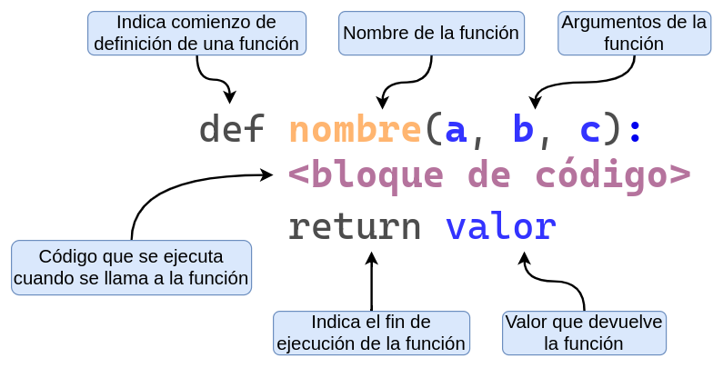
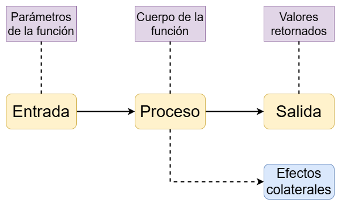

## ¿Qué es una función?

Una función puede pensarse como un "mini-programa" dentro de un programa más grande.
Su propósito es cumplir una tarea u objetivo específico, de forma independiente del resto del código.

El uso de funciones tiene varias ventajas:

* **Reutilización de código**: se define una sola vez y se ejecuta cuando sea necesario.
* **Mejor organización**: dividen el programa en partes más fáciles de leer y mantener.
* **Modularidad**: permiten construir programas como bloques independientes que pueden combinarse entre sí (¡funciones dentro de funciones!).

Consideremos el siguiente caso donde se busca calcuar el precio final de un producto, considerando impuestos y descuentos. 

```python
>>> precio_base = 800   # Precio del producto ($800)
>>> impuesto = 0.21     # Impuesto (21%)
>>> descuento = 0.10    # Descuento (10%)
>>> precio_final = precio_base * (1 + impuesto) * (1 - descuento)
>>> precio_final
871.2
```

¿Qué pasa si queremos calcular el precio final para otros productos con diferentes precios, impuestos o descuentos?

Una opción es repetir el código tantas veces como sea necesario...

```python
>>> precio_base = 500   # Precio del producto ($500)
>>> impuesto = 0.105    # Impuesto (10.5%)
>>> descuento = 0.0     # Descuento (0%)
>>> precio_final = precio_base * (1 + impuesto) * (1 - descuento)
>>> precio_final
552.5
```

```python
>>> precio_base = 2000  # Precio del producto ($2000)
>>> impuesto = 0.21     # Impuesto (21%)
>>> descuento = 0.20    # Descuento (20%)
>>> precio_final = precio_base * (1 + impuesto) * (1 - descuento)
>>> precio_final
1936.0
```

Otra opción, mucho mas conveniente, es utilizar funciones.

```python
>>> def calcular_precio(precio_base, impuesto, descuento):
...     resultado = precio_base * (1 + impuesto) * (1 - descuento)
...     return resultado
```

Luego, para utilizar la función simplemente la **llamamos** (o **invocamos**).

```python
>>> calcular_precio(800, 0.21, 0.10)
871.2
```

También es posible indicar los valores de los argumentos utilizando sus nombres.

```python
>>> calcular_precio(precio_base=2000, impuesto=0.21, descuento=0.20)
1936.0
```

## Definición de funciones

Analicemos las diferentes partes que forman la definición de una función en Python:

{fig-align="center" width="700px"}

* La palabra clave `def`:
    + Marca el inicio de la **definición** de una función.
    + Es una palabra reservada (_keyword_).
* El nombre de la función:
    + Debe seguir las mismas reglas que los nombres de las variables.
* Los argumentos de la función, dentro de paréntesis:
    + Se separan por comas y pueden ser 0 o más.
* Los dos puntos (`:`):
    + Indican el final de la línea de definición y el inicio del bloque de código.
* El bloque de código, que es el cuerpo de la función:
    + Es el código que se ejecuta cada vez que llamamos a la función.
* La sentencia `return` que indica el resultado que devuelve la función.
    + Luego del `return` viene el valor o nombre de la variable a devolver.
    + Es opcional (ya vamos a ver ejemplos).

::: {.callout-note}
### Observación 👀

En R se tiene que asignar de manera explícita una función a una variable. Por ejemplo:

```r
sumar <- function(x, y) {
    return(x + y)
}
```

En cambio, en Python, la sentencia `def` _define_ la función y le _asigna un nombre_ en un mismo paso.
:::

## Ejemplos

### 1. Suma de números

Comencemos con una función super sencilla. La misma se llama `sumar`, recibe dos argumentos `x` e `y`, y devuelve la suma de ambos.

```python
>>> def sumar(x, y):
...     return x + y
```

```python
>>> sumar(15, 21.9)
36.9
```

```python
>>> type(sumar(15, 21.9))
<class 'float'>
```

El valor que devuelve puede ser tratado como cualquier valor en Python. Por ejemplo, se lo puede asignar a una variable.

```python
>>> resultado = sumar(10, 11)
>>> resultado
21
```

Y el valor de esa variable puede ser luego pasado a una nueva llamada a `sumar()` (o a cualquier otra función).

```python
>>> sumar(resultado, 2.55)
23.55
```

Incluso es posible pasar expresiones y llamadas a funciones a la hora de pasar un argumento:

```python
>>> sumar(sumar(1, 2), 3)
6
```

En la línea `sumar(sumar(1, 2), 3)`, Python comienza evaluando la función `sumar()`.
Pero para poder hacerlo, primero necesita conocer los valores de los argumentos.
Al revisar el primer argumento, detecta que no es un valor directamente, sino otra llamada a la función `sumar(1, 2)`,
por lo que la evalúa primero.
El resultado de esa operación es `3`, que se toma como valor del primer argumento de la llamada externa.
El segundo argumento ya está dado: también es `3`.
Entonces, Python invoca la función `sumar()` con los argumentos `3` y `3`, cuyo resultado es `6`.
Finalmente, ese valor se muestra en pantalla.

### 2. Saludo personalizado

Otro ejemplo sencillo consiste en una función que recibe un nombre e imprime un saludo en pantalla.

```python
>>> def saludar(nombre):
...     print("Hola", nombre)
```

```python
>>> saludar("Pablo")
Hola Pablo
```

Esta función no devuelve un resultado, sino que utiliza el argumento recibido para mostrar un mensaje en pantalla.

```python
>>> saludar("Juan" + " Manuel")
Hola Juan Manuel
```

### 3. Sin parámetros

Y podemos tener funciones que no utilicen ningún argumento.

```python
>>> def decir_hola():
...     print("¡Hola!")
```

```python
>>> decir_hola()
¡Hola!
>>> decir_hola()
¡Hola!
>>> decir_hola()
¡Hola!
```

### 4. Devolución de múltiples valores

En Python, las funciones pueden devolver múltiples valores separándolos por comas en la sentencia `return`. Por ejemplo:

```python
>>> def potencias(x):
...     cuadrado = x ** 2
...     cubo = x ** 3
...     return cuadrado, cubo
>>> potencias(2)
(4, 8)
```

El resultado de este tipo de funciones puede ser asignado a múltiples variables.
De esta forma, podemos obtener el `cuadrado` y el `cubo` de un número con una sola llamada a una función.

```python
>>> cuadrado, cubo = potencias(8)
>>> print(cuadrado)
64
>>> print(cubo)
512
```

::: {.callout-note}
### Observación 👀

Al igual que en la asignación múltiple de variables,
lo que parece ser una función que devuelve **múltiples objetos** es en realidad una función que
devuelve un único objeto llamado tupla (de tipo `tuple`) que permite la técnica de _unpacking_.

No te preocupes, más adelante vamos a ver bien cómo funciona.
:::

## Diagrama de una función

{fig-align="center" width="600px"}

Algunos efectos colaterales pueden ser:

* Imprimir un texto o un gráfico.
* Cambiar el valor de una variable global.
* Crear, eliminar o modificar un archivo de la computadora.

::: {.callout-note}
### ¿Puedo devolver una salida y generar efectos colaterales a la vez? 🤔

Una función en Python puede realizar múltiples tareas, como devolver un valor e imprimir un mensaje en pantalla.

Por ejemplo:

```python
>>> def producto(x, y):
...     resultado = x * y
...     print("El producto es", resultado)
...     return resultado
```

La función `producto()` no solo calcula y devuelve el resultado de multiplicar `x` por `y`,
 sino que además muestra un mensaje por pantalla.

Sin embargo, en general no es una buena práctica combinar tareas distintas dentro de una misma función,
especialmente si son de distinta naturaleza (como _devolver_ un valor y _causar_ un efecto colateral).
Esto puede dificultar la reutilización y el mantenimiento del código.
:::

## Argumentos nombrados y posicionales

Al definir una función, debemos darle un nombre a cada uno de los argumentos que va a recibir.

Al llamar a la función, podemos pasar los valores de dos formas: **por posición** o **por nombre**.

Por ejemplo, las siguientes llamadas a la función `sumar()` son equivalentes:

```python
>>> sumar(x = 10, y = 15)
25
```

```python
>>> sumar(10, 15)
25
```

Si utilizamos los nombres para pasar los argumentos **no hace falta que estén en el mismo orden que en la definición** de la función.

```python
>>> sumar(y = 15, x = 10)
25
```

¡Que sea posible no significa que sea una buena práctica!

## Ausencia de `return`

La función `sumar()` termina con la siguiente línea:

```python
...     return x + y
```

Es decir, utiliza la sentencia `return` para devolver un valor.

Por otro lado, la función `saludar()` termina con un `print()` y no tiene ningún `return`.

```python
...     print("Hola", nombre)
```

```python
>>> resultado = sumar(1, 2)
>>> resultado
3
```

```python
>>> saludo = saludar("Juan")
Hola Juan
```

* ¿Cuál es el valor de la variable `saludo`?
* ¿Por qué?
* ¿Tiene sentido?

```python
>>> print(saludo)
None
```

En Python no existe el concepto de `return` implícito.

Si queremos que una función devuelva un valor, es necesario usar la instrucción `return` de forma explícita.

En caso de no hacerlo, la función devuelve automáticamente `None`.

## Argumentos por defecto

Cuando definimos una función podemos determinar **valores por defecto** para uno o más parámetros.

Si cuando llamamos a la función le pasamos un valor a ese parámetro, se utiliza el valor que pasamos.
Sino, se usa el valor por defecto.

Esta práctica es útil para simplificar las llamadas que realizamos a una función.

Supongamos la siguiente función `describir_mascota()` que tiene los parámetros `nombre` y `tipo`

```python
>>> def describir_mascota(nombre, tipo):
...     print("Tengo un", tipo)
...     print("Y su nombre es", nombre)
>>> describir_mascota("Bruno", "perro")
Tengo un perro
Y su nombre es Bruno
```

Ahora, hacemos que el parámetro `tipo` sea por defecto igual a `"perro"`.

```python
>>> def describir_mascota(nombre, tipo="perro"):
...     print("Tengo un", tipo)
...     print("Y su nombre es", nombre)
```

De este modo, es posible llamar a la función solamente pasando valores para aquellos parámetros sin valor por defecto:

```python
>>> describir_mascota("Bruno")
Tengo un perro
Y su nombre es Bruno
```

Como es de esperar, también es posible pasar valores distintos a los establecidos por defecto:

```python
>>> describir_mascota("Nemo", "pez")
Tengo un pez
Y su nombre es Nemo
```
