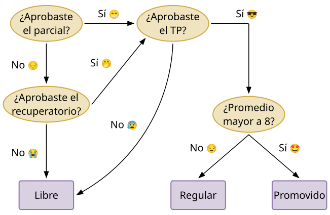
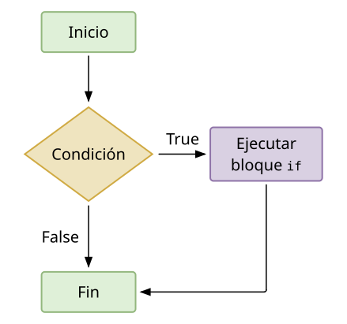
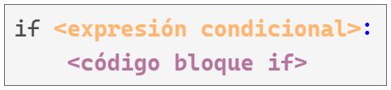
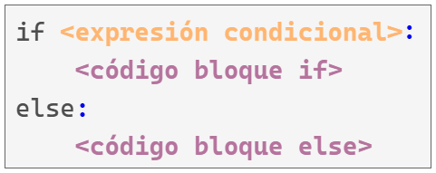
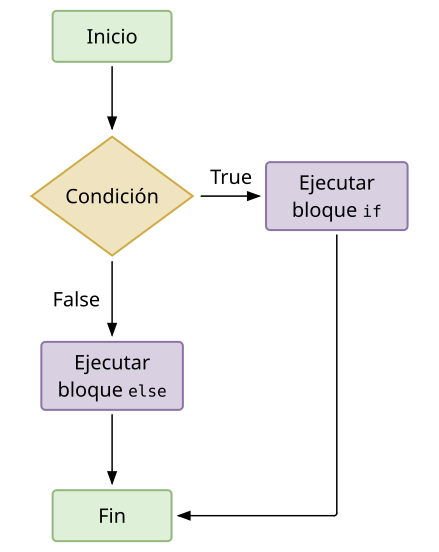
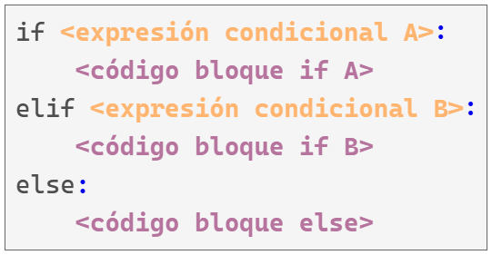
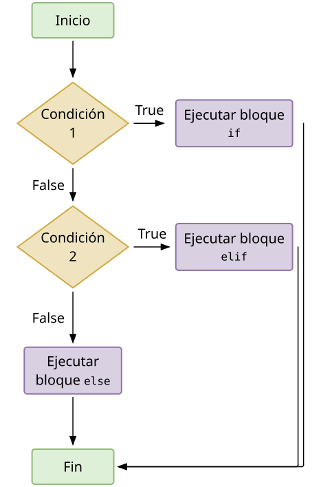
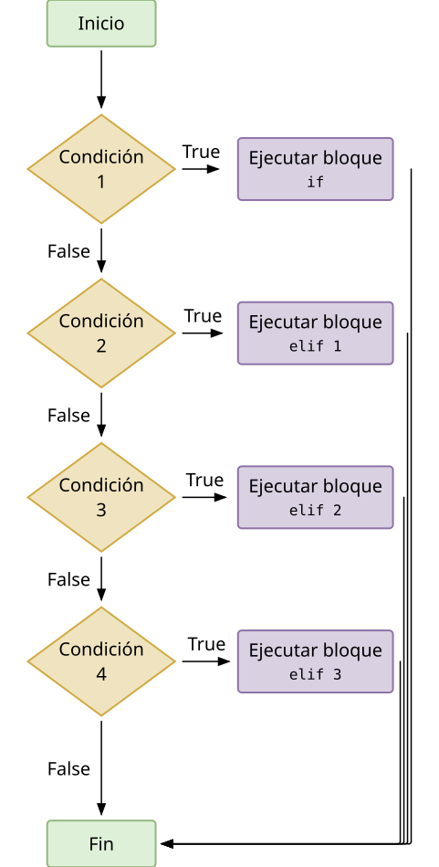
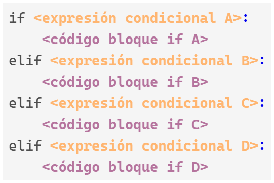

## Introducción

Las computadoras son muy buenas para muchísimas cosas. En particular:

* Determinar automáticamente que secciones de un programa se debe ejecutar.
* Realizar tareas repetitivas.

El primer punto se refiere a la **ejecución condicional de código** y el segundo a la **ejecución repetitiva de código**.

Estos dos puntos pueden ser vistos de manera general como **control de flujo** del código.
Y
En este apunte hablamos de la **ejecución condicional de código**.

{fig-align="center" width="600px"}

## Bloques `if`

Los bloques `if` utilizan la _keyword_ `if` para evaluar una condición y ejecutar una sección de código en base al resultado de esta evaluación.

{fig-align="center" width="350px"}

Veamos un ejemplo.

```python
condicion = True
if condicion:
    print("Se ejecuta el bloque if")
```

```text
Se ejecuta el bloque if
```

```python
condicion = False
if condicion:
    print("Se ejecuta el bloque if")
```

De manera mas general, un bloque `if` es de la siguiente forma:

{fig-align="center" width="400px"}

Tiene los siguientes componentes:

* La **palabra clave** `if`.
* La **condición** a evaluar, que tiene que ser `True` o `False`. Esta va seguida de los dos puntos `:` que indican el fin de la condición a evaluar y que lo siguiente es el bloque de código a ejecutar condicionalmente.
* El **bloque de código** a evaluar si **condición** es verdadera.


Veamos otro ejemplo.

```python
condicion = True
if condicion:
    print("Se ejecuta el bloque if")
```

```text
Se ejecuta el bloque if
```

```python
print("Esto se imprime siempre")
```

```text
Esto se imprime siempre
```

El segundo `print()` se imprime siempre porque está por fuera del bloque de ejecución condicional.

¿Cómo nos damos cuenta que no está dentro del bloque condicional?

Simplemente la indentación vuelve a ser normal. El fin de la indentación indica el fin del bloque de código.

```python
valor = 12
if valor > 10:
    print("Se ejecuta el bloque if")
```

```text
Se ejecuta el bloque if
```

## Bloques `if` - `else`

Vimos que el bloque `if` nos permite ejecutar un bloque de código de manera condicional, y que luego el programa sigue su ejecución normal.

También es posible que necesitemos ejecutar un bloque de código cuando las condiciones resulten en `True` y un bloque distinto en el caso contrario.

Para eso, utilizamos el bloque `if`-`else`.

Un bloque `if`-`else` es muy similar a un bloque `if`.

La diferencia es que nos permite definir otro bloque de código que se ejecuta cuando la prueba condicional es `False`.

{fig-align="center" width="400px"}

```python
edad = 21
if edad >= 16:
    print("Tenés la edad suficiente para votar")
else:
    print("Lo siento, aún sos demasiado jóven para votar")
```

```text
Tenés la edad suficiente para votar
```

{fig-align="center" width="350px"}

Al igual que con el bloque `if`, cualquier parte del código que se escriba luego del bloque `if`-`else` es ejecutada sin importar el valor de las condiciones.

Veamos otro ejemplo donde evaluamos si un número es par o impar.

```python
valor = 10
print(valor)
```

```text
10
```

```python
if valor % 2 == 0:
    mensaje = "Es par"
else:
    mensaje = "Es impar"
print(mensaje)
```

```text
Es par
```

En este caso, `print(mensaje)` se ejecuta siempre.

Lo que varía es el valor de la variable `mensaje`, que depende de si el número es par o impar.

## Bloques `if`-`elif`-`else`

Es muy probable que tengamos situaciones donde necesitemos considerar más de dos escenarios posibles.

Para esto, Python ofrece los bloques `if`-`elif`-`else`.

Este tipo de programa considera varias condiciones y las evalúa de a una a la vez hasta que alguna es verdadera. Luego se ejecuta solamente el bloque de código que corresponde a la primer condición verdadera.

{fig-align="center" width="400px"}

Supongamos que viene un parque de diversiones a Rosario y tiene los siguientes precios para la entrada:

* Menores de 4 años, gratis.
* Personas entre 4 y 18 años, \$400.
* Personas de 18 o mas años, \$600.

```python
edad = 3
if edad < 4:
    print("El costo de entrada para vos es de $0.")
elif edad < 18:
    print("El costo de entrada para vos es de $400.")
else:
    print("El costo de entrada para vos es de $600.")
```

```text
El costo de entrada para vos es de $0.
```

{fig-align="center" width="350px"}

## Múltiples bloques `elif`

Hasta ahora utilizamos un único bloque `elif`, pero podemos usar tantos como sea necesario.

Por ejemplo, si el parque de diversiones decide realizar un descuento para adultos mayores, dejando el precio en \$350, podriamos agregar otro bloque `elif` que represente la evaluación de esta condición.

```python
edad = 68
if edad < 4:
    precio = 0
elif edad < 18:
    precio = 400
elif edad < 65:
    precio = 600
else:
    precio = 350
print(f"El precio de entrada para vos es de ${precio}.")
```

```text
El precio de entrada para vos es de $350.
```

## Omitir el bloque `else`

No hay ninguna regla que nos obligue a terminar un bloque de `if`-`elif` con un bloque `else`.

Utilizar el bloque `else` a veces es lo correcto, pero otras veces puede ser mejor poner una condición explícita en un último `elif` que contemple solamente la condición que realmente nos interesa.

```python
edad = 10
if edad < 4:
    precio = 0
elif edad < 18:
    precio = 400
elif edad < 65:
    precio = 600
elif edad >= 65:
    precio = 350
print(f"El precio de entrada para vos es de ${precio}.")
```

```text
El precio de entrada para vos es de $400.
```

El bloque `elif` que agregamos indica que el `precio` será de \$350 cuando la edad de la persona sea mayor o igual a 65 años.

Esta condición es más explícita y fácil de entender que el bloque `else` que usábamos antes.

Sin embargo, todavía hay un problema: el programa sigue funcionando incluso si se ingresan edades fuera de un rango razonable. A continuación se muestra una versión más completa:

```python
edad = 125
if edad < 0:
    print("¡Error!")
    precio = None
elif edad < 4:
    precio = 0
elif edad < 18:
    precio = 400
elif edad < 65:
    precio = 600
elif edad >= 65 and edad <= 120:
    precio = 350
else:
    print("¡Error!")
    precio = None
```

```text
¡Error!
```

```python
print(f"El precio de entrada para vos es ${precio}.")
```

```text
El precio de entrada para vos es $None.
```

El diagrama y el código para el caso solo con `elif` se ven de la siguiente manera:

{fig-align="center" width="350px"}

{fig-align="center" width="400px"}
