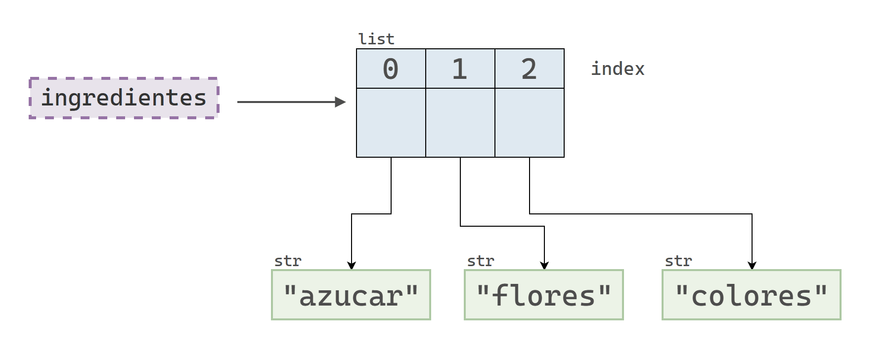
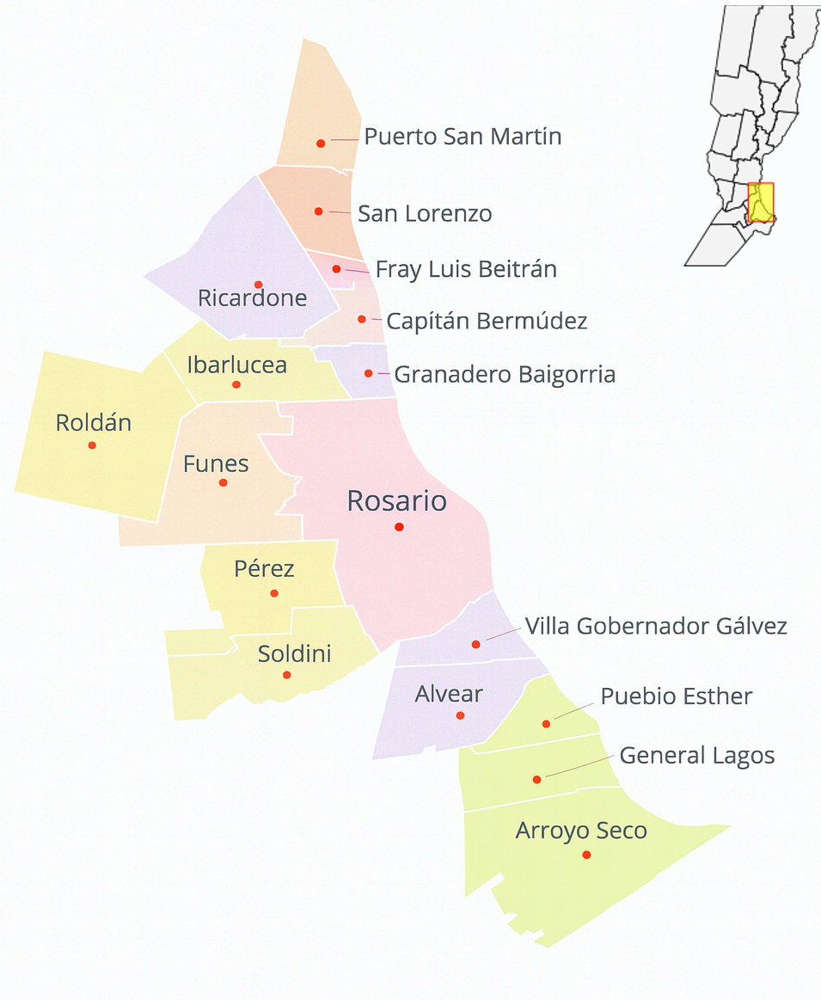

## Introducción

Además de los tipos de datos elementales que se presentaron en capítulos anteriores, Python proporciona estructuras de datos más complejas que permiten almacenar **colecciones de objetos**. Estas estructuras facilitan la organización de múltiples valores bajo un mismo nombre, posibilitando, entre otras tareas, su manipulación de manera conjunta.

En este capítulo exploraremos tres colecciones básicas de Python:

* Listas (`list`)
* Tuplas (`tuple`)
* Diccionarios (`dict`)

Estas estructuras tienen en común que permiten agrupar varios objetos, aunque presentan diferencias importantes en cuanto a la sintaxis utilizada para definirlas, su mutabilidad (capacidad de modificarse tras su creación) y las operaciones disponibles para manipular sus elementos. En definitiva, cada estructura está especialmente diseñada para representar relaciones particulares entre los datos, adaptándose así a diversas situaciones y necesidades de programación.

Supongamos que contamos con el nombre y la edad de 4 personas y queremos utilizar estos datos en nuestro programa.
Si solamente tenemos acceso a los tipos de datos elementales de Python, una alternativa para almacenar esta información consiste en crear 4 variables para las edades y 4 variables para los nombres:

```python
>>> nombre_1 = "Juan"
>>> nombre_2 = "Carla"
>>> nombre_3 = "Evelina"
>>> nombre_4 = "Leandro"
```

```text

```

```python
>>> edad_1 = 29
>>> edad_2 = 34
>>> edad_3 = 33
>>> edad_4 = 38
```

En este caso, el código es legible e incluso permite intuir la relación entre los nombres y las edades.

Sin embargo, vale preguntarse qué ocurriría si quisiéramos almacenar la información de muchas más personas. Python nos permitiría crear tantas variables como necesitemos, pero trabajar de esa manera no sería práctico ni sostenible.

Por eso, el lenguaje ofrece estructuras de datos que facilitan el manejo de grandes cantidades de valores del mismo tipo, de forma más organizada y eficiente.

## Listas

### Definición

El siguiente bloque de código genera una lista con los números 1, 2, 3, 4 y 5.

```python
>>> [1, 2, 3, 4, 5]
```

```text
[1, 2, 3, 4, 5]
```

Una lista de Python es una **secuencia ordenada de objetos mutable**. De manera menos técnica, podemos decir que una lista es un objeto que contiene otros objetos en un orden determinado  y cuyo contenido puede modificarse.

Las listas son una de las estructuras más utilizadas en Python. De hecho, programar en este lenguaje implica trabajar constantemente con listas: crearlas, modificarlas, recorrerlas y transformarlas.

Así que si queremos ser buenos Pythonistas, ¡a aprender de listas!

### Creación de listas

Las listas en Python se crean escribiendo los elementos entre corchetes (`[]`), separándolos con comas.

Creemos una lista que contenga los nombres de nuestras cafeterias de especialidad preferidas: Orlan, Infinita, Arto, Cristóbal, Ruffo y Heroica.

```python
>>> cafeterias = ["Orlan", "Infinita", "Arto", "Cristóbal", "Ruffo", "Heroica"]
>>> print(cafeterias)
```

```text
['Orlan', 'Infinita', 'Arto', 'Cristóbal', 'Ruffo', 'Heroica']
```

Cuando imprimimos una lista, Python muestra una representación muy parecida a la que usamos al definirla: con corchetes para encerrar los elementos y comas para separarlos.

Si consultamos el tipo de una lista, no hay sorpresas: es del tipo `list`.

```python
>>> type(cafeterias)
```

```text
<class 'list'>
```

### Objetos permitidos en una lista

En Python, una lista puede contener **objetos de cualquier tipo**. Incluso es posible mezclar distintos tipos en una misma lista.

Con los tipos de datos que vimos hasta ahora, podríamos tener listas con números, cadenas de texto, valores booleanos e incluso el valor nulo.

Por ejemplo, la siguiente lista contiene elementos de cuatro tipos distintos:

```python
>>> popurri = [1, "dos", True, None, "dos"]
>>> popurri
```

```text
[1, 'dos', True, None, 'dos']
```

Si bien las listas pueden mezclar objetos de distinto tipo, y algunas veces hacerlo tiene sentido, en general vamos a trabajar con listas donde todos sus objetos son del mismo tipo.

### Qué significa que una lista sea ordenada

Consideremos las listas `[1, 2, 3]` y `[2, 1, 3]`. Vale preguntarse si ambas listas son iguales o no. Veamos que dice Python:

```python
>>> [1, 2, 3] == [2, 1, 3]
```

```text
False
```

Dado que una lista es una secuencia en la que el orden de los elementos es relevante, dos listas son iguales solo si contienen los mismos elementos y en el mismo orden. A continuación se muestra un ejemplo en el que ambas condiciones se cumplen.

```python
>>> [1, 2, 3] == [1, 2, 3]
```

```text
True
```

También vale la pena preguntarse si dos listas iguales son, en memoria, el mismo objeto. Debajo definimos dos listas `x` e `y` con los mismos elementos, en el mismo orden. Como es de esperarse, ambas listas **son iguales en valor**.

```python
>>> x = ["a", "b", "c"]
>>> y = ["a", "b", "c"]
```

```text

```

```python
>>> print(x == y)
>>> print(x is y)
```

```text
True
False
```

Sin embargo, estas listas **no son iguales en memoria**, es decir, no son el mismo objeto.

```python
>>> print("id(x):", id(x))
>>> print("id(y):", id(y))
```

```text
id(x): 139758141199872
id(y): 139758141199744
```

::: {.callout-note}
##### Conclusión 📝

Dos listas son iguales (en valor) si en cada posición contienen elementos que también son iguales en valor. Sin embargo, que dos listas sean iguales no implica que sean el mismo objeto en memoria.
:::

::: {.callout-note}
##### Para pensar 🧠

¿Cuál es el resultado de la siguiente comparación?

```python
>>> [1, 2, 3] == [1.0, 2, 3.0]
```

:::

### Acceder a elementos

Dado que una lista es una secuencia ordenada, cada objeto tiene una posición determinada. Podemos acceder a cualquiera de los elementos de la lista indicando la posición del objeto que deseamos. Esta posición se conoce como **índice** (o _index_, en inglés).

Para acceder a un elemento de una lista, escribimos el nombre de la lista seguido de la posición del objeto que queremos seleccionar, encerrada entre corchetes `[]`.

Veamos un ejemplo utilizando la lista `cafeterias` que creamos anteriormente.

```python
>>> cafeterias = ["Orlan", "Infinita", "Arto", "Cristóbal", "Ruffo", "Heroica"]
>>> cafeterias
```

```text
['Orlan', 'Infinita', 'Arto', 'Cristóbal', 'Ruffo', 'Heroica']
```

Intentemos seleccionar el primer objeto de la lista:

```python
>>> cafeterias[1]
```

```text
'Infinita'
```

Cuando accedemos a un elemento individual de una lista, el resultado no es, en principio, otra lista, sino el objeto que se encuentra en esa posición. Ese objeto puede ser de cualquier tipo: un número, una cadena de texto, otra lista, etc.

Por lo tanto, si el elemento obtenido es una cadena de caracteres, podemos aplicar directamente los métodos que corresponden a ese tipo de dato. Por ejemplo, podemos encadenar la selección del elemento en la posición `1` con una llamada al método `.upper()`, sabiendo que es válido porque ese elemento es de tipo `str`.

```python
>>> cafeterias[1].upper()
```

```text
'INFINITA'
```

Como es de esperarse, también podemos incluir una operación de indexación dentro de una f-_string_.

```python
>>> f"¡Qué rico que es el café de {cafeterias[1]}!"
```

```text
'¡Qué rico que es el café de Infinita!'
```

::: {.callout-note}
##### Indexación desde cero 0️⃣

Observamos que `cafeterias[1]` devuelve `"Infinita"`, que es el elemento de la segunda posición, y no `"Orlan"`, que aparece primero.
Este resultado no es un error, sino una consecuencia de que Python usa **indexación desde cero** (_zero-based indexing_, en inglés).
Esto significa que, si una lista contiene 6 elementos, sus posiciones van desde el 0 al 5. En general:

* El primer elemento está en la posición **0**.
* El último elemento está en la posición **n - 1**.

:::

::: {.callout-note}
##### Misma sintaxis, significados distintos 🎭

En Python, los corchetes no siempre significan lo mismo. Sus dos funciones principales son la creación de listas y la indexación de secuencias. Un ejemplo curioso que combina ambos usos es el siguiente:

```python
>>> [0][0]
```

```text
0
```
:::

En el siguiente diagrama se muestra que la variable `cafeterias` referencia a un objeto de tipo `list`, que a su vez contiene referencias a distintos objetos de tipo `str`.
Cada uno de estos elementos está asociado a un índice, comenzando desde el 0.

{fig-align="center" width="700px"}

#### Índices negativos

Python también permite utilizar valores negativos como índices para seleccionar elementos.

* El índice `-1` indica el último elemento.
* El índice `-2` indica el penúltimo elemento.
* Y así sucesivamente.

```python
>>> cafeterias[-1]
```

```text
'Heroica'
```

```python
>>> cafeterias[-2]
```

```text
'Ruffo'
```

{fig-align="center" width="700px"}

### Acceder a sub-listas

Hasta ahora vimos que, al usar corchetes con un número entero, podemos acceder a un único elemento de una lista.
Si en cambio queremos obtener varios elementos a la vez, necesitamos usar una herramienta llamada _slice_ (o rebanada) que permite seleccionar un subconjunto de elementos de una secuencia.

La sintaxis para usar _slices_ es la siguiente:

```python
>>> lista[inicio:fin]
```

Esto crea una nueva lista con los elementos que van desde la posición `inicio` hasta la posición `fin`, **sin incluir esta última**.

Por ejemplo:

```python
>>> cafeterias[1:4]
```

```text
['Infinita', 'Arto', 'Cristóbal']
```

{fig-align="center" width="700px"}

Como los _slices_ incluyen el índice de inicio pero excluyen el de fin, el siguiente código funciona correctamente:

```python
>>> cafeterias[4:6]
```

```text
['Ruffo', 'Heroica']
```

{fig-align="center" width="700px"}

En Python, la sintaxis de los _slices_ permite omitir de forma implícita los valores de inicio o fin cuando se desea tomar una porción desde el principio o hasta el final de la lista. Por ejemplo:

* `:n` es equivalente a `0:n` y selecciona los primeros `n` elementos.
* `n:` es equivalente a `n:len(lista)` y selecciona desde la posición `n` hasta el final.

Estas formas abreviadas hacen el código más conciso sin perder claridad. Por ejemplo:

```python
>>> cafeterias[:3]
```

```text
['Orlan', 'Infinita', 'Arto']
```

{fig-align="center" width="700px"}

```python
>>> cafeterias[3:]
```

```text
['Cristóbal', 'Ruffo', 'Heroica']
```

{fig-align="center" width="700px"}

### Modificar, agregar y eliminar elementos

En general, nuestros programas utilizan las listas como **objetos dinámicos**, es decir, como estructuras cuyo contenido puede cambiar a lo largo del tiempo mediante la modificación, agregación o eliminación de sus elementos.

Por ejemplo, supongamos que desarrollamos una página web que permite el registro de usuarios. En este caso, es natural usar una lista para almacenar los nombres de quienes se registran. A medida que pase el tiempo, se espera que se registren nuevos usuarios, otros se den de baja, o algunos incluso decidan cambiar su nombre. Esto implica realizar operaciones sobre la lista, como **agregar**, **eliminar** o **modificar** sus elementos.

#### Modificar elementos

Para modificar un elemento se utiliza una sintaxis muy similar a la que utilizamos para acceder a un elemento.

Escribimos el nombre de la lista seguido del índice del objeto que queremos modificar y el valor que queremos asignar.

Supongamos que tenemos una lista con diferentes marcas de café: Puerto Blest, Martínez y Fuego Tostadores. 

```python
>>> marcas = ["Puerto Blest", "Martínez", "Fuego Tostadores"]
>>> marcas
```

```text
['Puerto Blest', 'Martínez', 'Fuego Tostadores']
```

¿Cómo hacemos para cambiar el valor del primer elemento? 

```python
>>> marcas[0] = "Cabrales"
>>> marcas
```

```text
['Cabrales', 'Martínez', 'Fuego Tostadores']
```

::: {.callout-note}
##### Una dosis de precisión 🎯

En esta sección, cuando hablamos de **modificar un elemento**, nos referimos a **reemplazar el objeto que se encuentra en una posición determinada** de la lista. Observemos el siguiente ejemplo:

```python
>>> ingredientes = ["azucar", "flores", "colores"]
>>> id_original = id(ingredientes[0])
```

```text

```

```python
>>> # "Modifico" el primer elemento
>>> ingredientes[0] = "pimienta"
>>> id_nuevo = id(ingredientes[0])
```

```text

```

```python
>>> print("ID original:", id_original)
>>> print("ID nuevo:", id_nuevo)
```

```text
ID original: 140666642416528
ID nuevo: 140666629298992
```

Este ejemplo muestra que la operación no modificó el objeto que se encontraba originalmente en el índice 0, sino que lo reemplazó por uno nuevo.

{fig-align="center" width="600px"}
:::


::: {.callout-note}
##### ¡Atención! 🤓

El ejemplo del bloque anterior demuestra que la sintaxis `lista[indice] = objeto` **reemplaza el objeto** que se encuentra en una determinada posición, en vez de modificarlo.
Sin embargo, vale la pena destacar que **sí es posible modificar un elemento de una lista**. Para ello, es necesario que el elemento sea un objeto mutable.
:::

#### Agregar elementos

Supongamos que queremos construir una lista con los nombres de las ciudades que forman parte del Gran Rosario. Para ello, vamos a utilizar el siguiente mapa como referencia. A medida que identifiquemos las distintas localidades, las vamos a ir incorporando a una lista de Python.

Agregar elementos a una lista es una tarea común en programación, y Python nos ofrece varias formas de hacerlo. En esta sección vamos a explorar algunos de estos métodos, entendiendo en qué se diferencian y cuándo conviene utilizar cada uno.

{fig-align="center" width="400px"}

Primero vamos a armar una lista que contenga los vecinos de Rosario, considerando solo aquellas localidades que limitan con la ciudad.

Supongamos que empezamos con una lista que contiene únicamente a la localidad de Funes. A partir de ahí, iremos agregando otras localidades vecinas utilizando distintos métodos que ofrece Python.

```python
>>> vecinos_de_rosario = ["Funes"]
>>> vecinos_de_rosario
```

```text
['Funes']
```

##### Agregar elementos al final de la lista

La manera más sencilla de agregar un nuevo elemento a una lista es utilizando el método `.append()`.

Este método recibe un **único elemento** como argumento y lo agrega al final de la lista.

```python
>>> vecinos_de_rosario.append("Soldini")
```

La llamada a este método parece no devolver ningún resultado. Observemos la lista nuevamente:

```python
>>> vecinos_de_rosario
```

```text
['Funes', 'Soldini']
```

El método `.append()` agregó `"Soldini"` al final de la lista sin retornar ningún valor. En lugar de crear una nueva lista, modificó directamente la que referencia nuestra variable `vecinos_de_rosario`. En otras palabras, el método `.append()` **no crea una nueva lista**, sino que **modifica directamente la lista existente**.

Veamos el siguiente ejemplo:

```python
>>> vecinos_de_rosario = []
>>> print("ID:", id(vecinos_de_rosario))
>>> print(vecinos_de_rosario, "\n")
```

```text

```

```python
>>> vecinos_de_rosario.append("Funes")
>>> print("ID:", id(vecinos_de_rosario))
>>> print(vecinos_de_rosario, "\n")
```

```text

```

```python
>>> vecinos_de_rosario.append("Soldini")
>>> print("ID:", id(vecinos_de_rosario))
>>> print(vecinos_de_rosario)
```

```text
ID: 139758141201280
[] 

ID: 139758141201280
['Funes'] 

ID: 139758141201280
['Funes', 'Soldini']
```

Como se puede observar, Python operó siempre sobre la misma lista. Esto se debe a que el método `.append()` modifica la lista existente, en lugar de crear una nueva en cada paso.

##### Insertar elementos en cualquier posición de una lista

Para insertar elementos en una lista también podemos utilizar el método `.insert()`.

¿Cuál es la diferencia entre `.append()` e `.insert()`?

* `.append()` agrega el nuevo elemento **al final** de la lista.
* `.insert()` permite insertar un elemento en **cualquier posición**, indicando el índice donde queremos ubicarlo.

Por ejemplo, si queremos insertar `"Villa Gobernador Gálvez"` al **principio** de la lista, podemos hacerlo con `.insert(0, "Villa Gobernador Gálvez")`.

```python
>>> vecinos_de_rosario.insert(0, "Villa Gobernador Gálvez")
>>> vecinos_de_rosario
```

```text
['Villa Gobernador Gálvez', 'Funes', 'Soldini']
```

El método `.insert()` agregó a `"Villa Gobernador Gálvez"` en el inicio de la lista y corrió o trasladó al resto de los elementos hacia la derecha.

Y si ahora queremos agregar a `"Pérez"` en la tercera posición de la lista, simplemente:

```python
>>> vecinos_de_rosario.insert(2, "Pérez")
>>> vecinos_de_rosario
```

```text
['Villa Gobernador Gálvez', 'Funes', 'Pérez', 'Soldini']
```

Al igual que `.append()`, `.insert()` también modifica la lista existente en vez de devolver una lista nueva.

::: {.callout-note}
##### ¿Qué significa _in-place_? 🤔

Que una operación sea _in-place_ significa que la operación modifica directamente el objeto original, sin crear uno nuevo.
Por ejemplo, `objetos.append(e)` agrega el elemento `e` a la lista existente `objetos` en lugar de crear y devolver una lista nueva.

:::

#### Combinar listas

En la sección anterior vimos cómo insertar elementos individuales en una lista. Ahora vamos a explorar otra operación muy común: **combinar listas**.

Supongamos que ya tenemos una lista llamada `vecinos_de_rosario`, y otra llamada `vecinos_al_norte`. Queremos unir ambas listas para tener toda la información en una sola. Para lograrlo, una opción es usar el método `.extend()`, que nos permite agregar todos los elementos de una lista al final de otra, modificando directamente la lista original.

```python
>>> print(vecinos_de_rosario)
```

```text
['Villa Gobernador Gálvez', 'Funes', 'Pérez', 'Soldini']
```

```python
>>> vecinos_al_norte = ["Granadero Baigorria", "Ibarlucea"]
```

```text

```

```python
>>> vecinos_de_rosario.extend(vecinos_al_norte)
>>> vecinos_de_rosario
```

```text
['Villa Gobernador Gálvez', 'Funes', 'Pérez', 'Soldini', 'Granadero Baigorria', 'Ibarlucea']
```

De la misma manera que `.append()` agrega un elemento al final de una lista, el método `.extend()` permite agregar **todos los elementos de otra lista** al final.

Otra forma de combinar listas es utilizando el operador de suma `+`, que realiza una concatenación de listas. A diferencia de `.extend()`, este operador **no modifica las listas originales**, sino que devuelve una nueva lista con los elementos de las dos listas originales concatenados en una nueva.

Para ver cómo funciona, primero vamos a construir una lista llamada `otras_localidades`, que contiene localidades del Gran Rosario que no están pegadas a Rosario. Luego, vamos a concatenar esa lista a la que ya tenemos.

```python
>>> otras_localidades = [
...     "Puerto San Martín",
...     "San Lorenzo",
...     "Fray Luis Beltrán",
...     "Capitán Bermudez",
...     "Ricardone",
...     "Roldán",
...     "Alvear",
...     "Pueblo Esther",
...     "General Lagos",
...     "Arroyo Seco"
... ]
```

Primero, observemos los IDs de las listas que vamos a combinar:

```python
>>> print(id(vecinos_de_rosario))
>>> print(id(otras_localidades))
```

```text
139758141201280
139758141196160
```

Y concatenemos ambas listas utilizando el operador de suma:

```python
>>> vecinos_de_rosario + otras_localidades
```

```text
['Villa Gobernador Gálvez', 'Funes', 'Pérez', 'Soldini', 'Granadero Baigorria', 'Ibarlucea', 'Puerto San Martín', 'San Lorenzo', 'Fray Luis Beltrán', 'Capitán Bermudez', 'Ricardone', 'Roldán', 'Alvear', 'Pueblo Esther', 'General Lagos', 'Arroyo Seco']
```

Podemos notar que la operación sí retorna una lista como resultado, la cual podríamos guardar en una nueva variable.

```python
>>> gran_rosario = vecinos_de_rosario + otras_localidades
>>> gran_rosario
```

```text
['Villa Gobernador Gálvez', 'Funes', 'Pérez', 'Soldini', 'Granadero Baigorria', 'Ibarlucea', 'Puerto San Martín', 'San Lorenzo', 'Fray Luis Beltrán', 'Capitán Bermudez', 'Ricardone', 'Roldán', 'Alvear', 'Pueblo Esther', 'General Lagos', 'Arroyo Seco']
```

Y finalmente, se puede ver que las listas originales no se han modificado y que `gran_rosario` referencia una lista nueva.

```python
>>> print(id(vecinos_de_rosario))
>>> print(vecinos_de_rosario, "\n")
```

```text

```

```python
>>> print(id(otras_localidades))
>>> print(otras_localidades, "\n")
```

```text

```

```python
>>> print(id(gran_rosario))
>>> print(gran_rosario, "\n")
```

```text
139758141201280
['Villa Gobernador Gálvez', 'Funes', 'Pérez', 'Soldini', 'Granadero Baigorria', 'Ibarlucea'] 

139758141196160
['Puerto San Martín', 'San Lorenzo', 'Fray Luis Beltrán', 'Capitán Bermudez', 'Ricardone', 'Roldán', 'Alvear', 'Pueblo Esther', 'General Lagos', 'Arroyo Seco'] 

139758141197696
['Villa Gobernador Gálvez', 'Funes', 'Pérez', 'Soldini', 'Granadero Baigorria', 'Ibarlucea', 'Puerto San Martín', 'San Lorenzo', 'Fray Luis Beltrán', 'Capitán Bermudez', 'Ricardone', 'Roldán', 'Alvear', 'Pueblo Esther', 'General Lagos', 'Arroyo Seco'] 
```

#### Eliminar elementos

Así como es común agregar elementos a una lista o combinar listas para crear nuevas, también lo es eliminar elementos.

Por ejemplo, si en una página web guardamos los nombres de los usuarios en una lista, y uno de ellos se da de baja, necesitaremos eliminar su nombre de esa lista.

Para ilustrarlo, vamos a crear una lista de usuarios ficticios:

```python
>>> usuarios = ["cyberwolf", "neo_404", "pixelbyte", "alphaX", "quantum.dev"]
>>> usuarios
```

```text
['cyberwolf', 'neo_404', 'pixelbyte', 'alphaX', 'quantum.dev']
```

##### Eliminar elementos utilizando `del`

La sentencia `del`, que ya usamos para eliminar variables, también puede usarse para eliminar elementos de una lista.

Para hacerlo, necesitamos conocer la posición del elemento que queremos eliminar.

Por ejemplo, si queremos eliminar a `"neo_404"`, que está en la segunda posición, podemos hacerlo con:

```python
>>> print(usuarios)
```

```text

```

```python
>>> del usuarios[1]
```

```text

```

```python
>>> print(usuarios)
```

```text
['cyberwolf', 'neo_404', 'pixelbyte', 'alphaX', 'quantum.dev']
['cyberwolf', 'pixelbyte', 'alphaX', 'quantum.dev']
```

##### Eliminar elementos con `.pop()`

Si bien la sentencia `del` permite eliminar elementos de una lista, no nos da acceso al elemento eliminado.

Sin embargo, en muchos casos queremos extraer un elemento de una lista para utilizarlo en otra parte de nuestro programa.
Por ejemplo, si tenemos una lista de usuarios, tal vez nos interesa guardar el nombre del usuario que se elimina en otra lista que registre los usuarios dados de baja.

Para eso podemos usar el método `.pop()`, que elimina un elemento de la lista y, al mismo tiempo, lo devuelve.

```python
>>> usuarios = ["cyberwolf", "neo_404", "pixelbyte", "alphaX", "quantum.dev"]
>>> usuario_eliminado = usuarios.pop(2)
```

```text

```

```python
>>> print(usuarios) # "pixelbyte" es 'extraido'
>>> print(usuario_eliminado)
```

```text
['cyberwolf', 'neo_404', 'alphaX', 'quantum.dev']
'pixelbyte'
```

En resumen, `usuarios.pop(2)` busca el valor en la tercera posición, lo extrae de la lista y lo devuelve.

También es posible usar `.pop()` sin indicar una posición. En ese caso, extrae el último elemento de la lista por defecto.

```python
>>> usuarios = ["cyberwolf", "neo_404", "pixelbyte", "alphaX", "quantum.dev"]
>>> print(usuarios, "\n")
```

```text

```

```python
>>> usuario_eliminado = usuarios.pop()
>>> print(usuario_eliminado)
>>> print(usuarios, "\n")
```

```text

```

```python
>>> usuario_eliminado = usuarios.pop()
>>> print(usuario_eliminado)
>>> print(usuarios)
```

```text
['cyberwolf', 'neo_404', 'pixelbyte', 'alphaX', 'quantum.dev']

quantum.dev
['cyberwolf', 'neo_404', 'pixelbyte', 'alphaX']

alphaX
['cyberwolf', 'neo_404', 'pixelbyte']
```

Y podríamos continuar así hasta vaciar la lista.

##### Eliminar elementos con `.remove()`

El método `.remove()` es útil para cuando queremos eliminar elementos de una lista a partir de su valor, en lugar de su posición. Por ejemplo:

```python
>>> usuarios = ["cyberwolf", "neo_404", "pixelbyte", "alphaX", "quantum.dev"]
>>> print(usuarios)
```

```text

```

```python
>>> usuarios.remove("cyberwolf")
>>> print(usuarios)
```

```text
['cyberwolf', 'neo_404', 'pixelbyte', 'alphaX', 'quantum.dev']
['neo_404', 'pixelbyte', 'alphaX', 'quantum.dev']
```

Al igual que `del`, remove no devuelve el valor que se remueve.

::: {.callout-note}
##### Resumen 📌

| Herramienta        | Qué hace                                                   | Cómo se usa                          | Devuelve              |
| ------------------ | ---------------------------------------------------------- | ------------------------------------ | --------------------- |
| `del`              | Elimina un elemento por índice o un segmento por _slicing_ | `del lista[i]` <br> `del lista[i:j]` | Nada                  |
| `.pop()`           | Elimina un elemento por índice (por defecto el último)     | `lista.pop(i)` <br> `lista.pop()`    | El elemento eliminado |
| `.remove()`        | Elimina la **primera** ocurrencia de un valor dado         | `lista.remove(valor)`                | Nada                  |

:::

### Funciones y métodos útiles

#### Ordenamiento

Es común que las listas se creen sin seguir un orden particular.
Sin embargo, en algunas situaciones puede ser importante conservar el orden en que se agregaron los elementos,
mientras que en otras puede resultar útil trabajar con los datos ordenados, por ejemplo, para facilitar su presentación.

En Python existen al menos dos formas de obtener listas ordenadas.

##### El método `.sort()`

Para ordenar una lista de manera sencilla, podemos usar el método `.sort()`.
Veamos un par de ejemplos para entender cómo funciona.

```python
>>> productos = ["Fanta", "Coca Cola", "Sprite"]
>>> productos.sort()
>>> print(productos)
```

```text
['Coca Cola', 'Fanta', 'Sprite']
```

```python
>>> precios = [100, 110, 80.0, 70]
>>> precios.sort()
>>> print(precios)
```

```text
[70, 80.0, 100, 110]
```

Podemos concluir que el método `.sort()` realiza un **ordenamiento permanente**, ya que modifica directamente la lista sobre la que se aplica y no devuelve una nueva.
Esto significa que, una vez ejecutado, no es posible recuperar la lista original a menos que la hayamos guardado previamente.

Por defecto, el ordenamiento se hace de menor a mayor: en el caso de cadenas de texto, se compara caracter por caracter, y en el caso de números, se ordenan a partir de su valor.

**¿Cómo hacemos para ordenar de manera decreciente?**

El método `.sort()` tiene un argumento llamado `reverse`. Si este valor es igual a `True`, se ordenan los elementos de mayor a menor.

```python
>>> productos = ["Fanta", "Coca Cola", "Sprite"]
>>> productos.sort(reverse=True)
>>> print(productos)
```

```text
['Sprite', 'Fanta', 'Coca Cola']
```

```python
>>> precios = [100, 110, 80, 70]
>>> precios.sort(reverse=True)
>>> print(precios)
```

```text
[110, 100, 80, 70]
```

##### La función `sorted()`
Al igual que el método `.sort()`, la función `sorted()` permite ordenar una lista.
La diferencia principal es que `sorted()` **no modifica la lista original**, sino que **devuelve una nueva lista ordenada**.
Esto resulta útil cuando queremos conservar tanto el orden original como una versión ordenada de la misma lista.

Veamos algunos ejemplos breves:

```python
>>> juegos = ["Counter Strike", "The Sims", "Age of Empires II", "League of Legends", "Among Us"]
>>> juegos_ordenados = sorted(juegos)
```

```text

```

```python
>>> print("Esta es la lista original:")
>>> print(juegos, "\n")
```

```text

```

```python
>>> print("Esta es la lista ordenada:")
>>> print(juegos_ordenados)
```

```text
Esta es la lista original:
['Counter Strike', 'The Sims', 'Age of Empires II', 'League of Legends', 'Among Us']

Esta es la lista ordenada:
['Age of Empires II', 'Among Us', 'Counter Strike', 'League of Legends', 'The Sims']
```

```python
>>> print("id(juegos):".ljust(22), id(juegos))
>>> print("id(juegos_ordenados):".ljust(22), id(juegos_ordenados))
```

```text
id(juegos):            139758141112064
id(juegos_ordenados):  139758141196416
```

Al igual que `.sort()`, `sorted()` también tiene un argumento que determina el orden:

```python
>>> sorted(juegos, reverse=True)
```

```text
['The Sims', 'League of Legends', 'Counter Strike', 'Among Us', 'Age of Empires II']
```

#### Invertir el orden con `.reverse()`

Hasta ahora vimos cómo ordenar listas de menor a mayor y de mayor a menor.

Otra operación común es invertir el orden de los elementos, y para eso podemos usar el método `.reverse()`.

Al igual que `.sort()`, esta operación modifica la lista original de forma permanente.

```python
>>> productos = ["Fanta", "Coca Cola", "Sprite"]
>>> productos.reverse()
>>> print(productos)
```

```text
['Sprite', 'Coca Cola', 'Fanta']
```

Si nos arrepentimos de haber invertido el orden, podemos usar `.reverse()` nuevamente y recuperamos el orden original.

```python
>>> productos.reverse()
>>> print(productos)
```

```text
['Fanta', 'Coca Cola', 'Sprite']
```

::: {.callout-note}
##### ¿Y la función `reversed()`? 🤔

Así como tenemos `.sort()` y `sorted()`, uno podría preguntarse si existe un `reversed()` que complemente `.reverse()`.

La respuesta es sí, `reversed()` existe. Sin embargo, su resultado no es una lista, sino un tipo de objeto que aún no hemos explorado.

Sin embargo, lo vamos a ver más adelante 😊

:::

#### Cantidad de elementos

Para saber cuantos elementos hay en una lista utilizamos la función `len()`.

Por ejemplo, para obtener la cantidad de usuarios de manera programática:

```python
>>> usuarios = ["cyberwolf", "neo_404", "pixelbyte", "alphaX", "quantum.dev"]
>>> print(usuarios)
>>> len(usuarios)
```

```text
['cyberwolf', 'neo_404', 'pixelbyte', 'alphaX', 'quantum.dev']
5
```

Y para obtener la cantidad de ciudades del Gran Rosario (aunque falte una 😉):

```python
>>> print(gran_rosario)
>>> len(gran_rosario)
```

```text
['Villa Gobernador Gálvez', 'Funes', 'Pérez', 'Soldini', 'Granadero Baigorria', 'Ibarlucea', 'Puerto San Martín', 'San Lorenzo', 'Fray Luis Beltrán', 'Capitán Bermudez', 'Ricardone', 'Roldán', 'Alvear', 'Pueblo Esther', 'General Lagos', 'Arroyo Seco']
16
```

#### Existencia de elemento

Para evaluar si un determinado elemento se encuentra en una lista utilizamos el operador `in`.

```python
>>> nuevo_usuario = "pepito"
>>> nuevo_usuario in usuarios
```

```text
False
```

Que correctamente indica que `"pepito"` no está en nuestra base de usuarios. Por otro lado,

```python
>>> "cyberwolf" in usuarios
```

```text
True
```

¿Y cómo preguntar si algún elemento **no está** dentro de la lista? Para eso, utilizamos el operador `not in`.

```python
>>> "Colón" not in gran_rosario
```

```text
True
```

La respuesta es `True` porque efectivamente `"Colón"` **no pertenece** al Gran Rosario.

Este es uno de los tantos ejemplos donde Python se parece mucho mas al lenguaje humano que al lenguaje de las computadoras.

#### Posición de un elemento

Si queremos conocer la posición de un elemento en la lista podemos utilizar el método `.index()`. Por ejemplo:

```python
>>> vocales = ["a", "e", "i", "o", "u"]
>>> vocales
```

```text
['a', 'e', 'i', 'o', 'u']
```

```python
>>> vocales.index("i")
```

```text
2
```

Al igual que `.remove()`, el método `.index()` actúa sobre el primer elemento de la lista que coincide con el valor indicado. Es decir, si hay múltiples apariciones del mismo valor, solo se considera la primera.

```python
>>> ["a", "a", "a"].index("a")
```

```text
0
```

El resultado es `0` porque esa es la primera posición en la que aparece `"a"` en la lista. Sin embargo, esto no quiere decir que `"a"` aparezca una sola vez; simplemente indica la ubicación de su **primera ocurrencia**.

#### Frecuencia de un elemento

Si queremos saber cuántas veces aparece un elemento en una lista, podemos usar el método `.count()`.
Este método devuelve la cantidad de ocurrencias del valor indicado dentro de la lista.

```python
>>> ["a", "a", "a"].count("a")
```

```text
3
```

```python
>>> ["a", "a", "a"].count("b")
```

```text
0
```

#### Estadísticas básicas

Python ofrece funciones que nos permiten calcular fácilmente algunas estadísticas básicas o medidas resumen, como el mínimo, el máximo y la suma de los elementos de una lista.

Se destacan:

* `min()`, que devuelve el valor mínimo
* `max()`, que devuelve el valor máximo
* `sum()`, que devuelve la suma total

Veamos algunos ejemplos:

```python
>>> numeros = [3, 7.5, 12, 1.2, 9, 4.8, 6, 15.3, 2.1, 8]
>>> numeros
```

```text
[3, 7.5, 12, 1.2, 9, 4.8, 6, 15.3, 2.1, 8]
```

```python
>>> print("Valor mínimo:", min(numeros))
>>> print("Valor máximo:", max(numeros))
>>> print("Suma de valores:", sum(numeros))
```

```text
Valor mínimo: 1.2
Valor máximo: 15.3
Suma de valores: 68.9
```

### Resumen de métodos _in-place_


| **Método**          | **Descripción**                                                       |
|---------------------|-----------------------------------------------------------------------|
| `.append(x)`        | Inserta el valor `x` al final de la lista                             |
| `.pop(i)`           | Remueve y devuelve el elemento en la posición `i`                     |
| `.insert(i, x)`     | Inserta el valor `x` en la posición `i`                               |
| `.extend(iterable)` | Inserta todos los valores de `iterable` al final de la lista          |
| `.index(x)`         | Devuelve el la posición donde `x` aparece por primera vez en la lista |
| `.count(x)`         | Devuelve la cantidad de veces que aparece `x` en la lista             |
| `.sort()`           | Ordena los elementos de la lista, de menor a mayor                    |
| `.reverse()`        | Invierte el orden de los elementos en la lista                        |

## Tuplas

### Definición

El siguiente bloque de código genera una tupla con los números 1, 2, 3, 4 y 5.

```python
>>> (1, 2, 3, 4, 5)
```

```text
(1, 2, 3, 4, 5)
```

Una tupla es una secuencia ordenada de objetos inmutable. Al igual que las listas, permite almacenar múltiples elementos de cualquier tipo y acceder a ellos por posición. Muchas de las operaciones que usamos con listas también funcionan con tuplas. La diferencia clave es que las listas son **mutables** (se pueden modificar), mientras que las tuplas son **inmutables** (no se pueden cambiar una vez creadas).

Las tuplas suelen utilizarse para representar registros o estructuras simples.
En general, las tuplas se utilizan para representar:

* Una **colección fija de valores posibles** para un cierto atributo (e.g., [Identificaciones válidas](#sec-identificaciones-validas)), o
* Los distintos **atributos de un objeto**. En este caso, cada tupla es como un registro de una base de datos (e.g., [Baraja española](#sec-baraja)).

### Ejemplos

#### Identificaciones válidas {#sec-identificaciones-validas}

Supongamos que trabajamos en un aeropuerto internacional y estamos implementando un programa de autenticación de personas. Para ello, necesitamos definir los tipos de identificación que se aceptan. Por ejemplo: LE, LC, DNI, CUIT, CUIL y Pasaporte.

Como esperamos que estos tipos no vayan a cambiar con el tiempo (¡al menos mientras corre nuestro programa!), tiene sentido utilizar una tupla (inmutable) en vez de una lista (mutable).

```python
>>> tipos_identificacion = ("LE", "LC", "DNI", "CUIT", "CUIL", "Pasaporte")
>>> tipos_identificacion
```

```text
('LE', 'LC', 'DNI', 'CUIT', 'CUIL', 'Pasaporte')
```

```python
>>> type(tipos_identificacion)
```

```text
<class 'tuple'>
```

Al igual que con las listas, podemos utilizar los índices para acceder a los elementos de la tupla:

```python
>>> print(tipos_identificacion[0])
>>> print(tipos_identificacion[-1])
```

```text
LE
Pasaporte
```

Al contrario de lo que sucede con las listas, no es posible modificar ninguno de sus elementos existentes:

```python
>>> tipos_identificacion[0] = "NUEVO_TIPO"
```
:::{.code-error}
```python
    tipos_identificacion[0] = "NUEVO_TIPO"
    ~~~~~~~~~~~~~~~~~~~~^^^
TypeError: 'tuple' object does not support item assignment
```
:::

Sin embargo, si necesitamos combinar una o más tuplas en otra tupla, sigue siendo posible utilizar el operador de suma (`+`) para concatenar tuplas y así crear una nueva, con sus elementos concatenados.

```python
>>> tupla_nueva = tipos_identificacion + ("NT1", "NT2")
>>> tupla_nueva
```

```text
('LE', 'LC', 'DNI', 'CUIT', 'CUIL', 'Pasaporte', 'NT1', 'NT2')
```

```python
>>> print("id(tipos_identificacion):", id(tipos_identificacion))
>>> print("id(tupla_nueva):".ljust(25), id(tupla_nueva))
```

```text
id(tipos_identificacion): 139758140720608
id(tupla_nueva):          139758140922048
```

Así, se genera una nueva tupla mientras que la original se mantiene intacta.

#### Baraja española {#sec-baraja}

Supongamos que queremos desarrollar un _software_ para jugar al truco en línea con nuestros amigos. Tarde o temprano, vamos a necesitar una forma de representar las cartas de la baraja española.

Esta baraja está compuesta por 40 cartas, divididas en 4 palos: **oros**, **copas**, **espadas** y **bastos**. Cada palo incluye las siguientes cartas: 1, 2, 3, 4, 5, 6, 7, 10, 11 y 12.

Una forma simple y efectiva de representar esta baraja en Python es utilizando una **lista de tuplas**: la lista representa el mazo completo, y cada tupla representa una carta individual. 
Cada tupla tiene dos elementos: el **palo** y el **valor**.
Es decir, cada carta se representa así:

```python
>>> (palo, valor)
```

Por ejemplo: `("espadas", 7)` representa el **7 de espadas**.

```python
>>> baraja = [
...     ("oros", 1), ("oros", 2), ("oros", 3), ("oros", 4), ("oros", 5),
...     ("oros", 6),  ("oros", 7), ("oros", 10), ("oros", 11), ("oros", 12),
...     ("copas", 1), ("copas", 2), ("copas", 3), ("copas", 4), ("copas", 5),
...     ("copas", 6), ("copas", 7), ("copas", 10), ("copas", 11), ("copas", 12),
...     ("espadas", 1), ("espadas", 2), ("espadas", 3), ("espadas", 4), ("espadas", 5),
...     ("espadas", 6), ("espadas", 7), ("espadas", 10), ("espadas", 11), ("espadas", 12),
...     ("bastos", 1), ("bastos", 2), ("bastos", 3), ("bastos", 4), ("bastos", 5),
...     ("bastos", 6), ("bastos", 7), ("bastos", 10), ("bastos", 11), ("bastos", 12)
... ]
```

De este modo, cada tupla representa una carta y resalta su característica de inmutable.

### Cuándo usar tuplas

Si las tuplas se parecen tanto a las listas, ¿para qué existen?

Las tuplas son apropiadas cuando se necesita una **colección inmutable**, es decir, una secuencia que no debe cambiar ni en contenido ni en tamaño.
Esto evita modificaciones accidentales y, además, es más eficiente en memoria que una lista.

Aunque suelen usarse con **datos heterogéneos**, el criterio más importante es la inmutabilidad.
Si la colección va a cambiar, no corresponde usar una tupla, independientemente del tipo de datos que esta contenga.

Finalmente, aunque usar una lista en lugar de una tupla no afecte significativamente el rendimiento de un programa particular,
elegir la estructura adecuada mejora la legibilidad: una tupla deja en claro que esa secuencia no se modifica en ningún momento.

### Diferencias entre listas y tuplas

Cómo las creamos:

* Para crear listas usamos `[]`.
* Para crear tuplas usamos `()` (no es del todo cierto, ver **Definición de tuplas 🔍**).

Comportamiento "dinámico" vs "estático":

* El tamaño de las listas puede ser modificado luego de ser creado (dinámico).
* El tamaño de las tuplas no puede ser modificado luego de ser creado (estático).

Objetos "mutables" vs "inmutables":

* Los elementos de la lista se pueden modificar luego de ser creada (mutable).
* Los elementos de una tupla no se pueden modificar (inmutable).


Más allá de sus diferencias, las listas y las tuplas tienen **muchas similitudes**:

* Son secuencias **ordenadas**.
* Pueden contener **objetos de distintos tipos** al mismo tiempo.
* Permiten acceder a los elementos mediante su **índice**.
* Admiten operaciones de **_slicing_** para obtener subconjuntos.

::: {.callout-note}
##### Definición de tuplas 🔍

Hasta ahora dijimos que las tuplas se crean utilizando paréntesis y separando los elementos con comas. Pero eso no es del todo cierto.

En realidad, **los paréntesis no son necesarios** para definir una tupla. Lo que define a una tupla en Python es la **coma**, no los paréntesis. Por ejemplo:

```python
>>> t = 10, 25.0, 50
>>> print(t)
>>> print(type(t))
```

```text
(10, 25.0, 50)
<class 'tuple'>
```

Los paréntesis en Python se usan principalmente para agrupar expresiones y modificar el orden de evaluación, pero no son lo que convierte una serie de valores en una tupla.
Si pensáramos a los paréntesis como una función, simplemente devuelven el mismo objeto que encierran.

Dicho esto, el uso de paréntesis es una convención ampliamente aceptada a la hora de definir tuplas. De hecho, por más que los paréntesis no sean necesarios para su definición, Python siempre muestra a las tuplas entre paréntesis.
:::

## Diccionarios

En el ejemplo al inicio de este apunte presentamos el siguiente bloque de código:

```python
>>> nombre_1 = "Juan"
>>> nombre_2 = "Carla"
>>> nombre_3 = "Evelina"
>>> nombre_4 = "Leandro"
```

```text

```

```python
>>> edad_1 = 29
>>> edad_2 = 34
>>> edad_3 = 33
>>> edad_4 = 38
```

A simple vista, se pudo concluir que existía una relación entre los nombres y las edades. Por ejemplo, pudimos deducir que la edad de Juan es de 29 años.

Con las herramientas adquiridas en este apunte podríamos representar esta información de las siguientes dos maneras:

```python
>>> nombres = ["Juan", "Carla", "Evelina", "Leandro"]
>>> edades = [29, 34, 33, 38]
```

Así, el elemento ubicado en la posición i-ésima de la lista `nombres` se corresponde con el elemento de la misma posición en la lista `edades`.

En principio, este enfoque resuelve el problema de tener que crear una variable distinta para cada valor. Sin embargo, mantener dos colecciones mutables e independientes en sincronía puede convertirse en un verdadero dolor de cabeza. De hecho, podemos estar casi seguros de que, tarde o temprano, esa sincronía se va a romper.

Otra alternativa es la siguiente:

```python
>>> personas = [("Juan", 29), ("Carla", 34), ("Evelina", 33), ("Leandro", 38)]
```

Ahora, contamos con un único objeto de Python que reúne toda la información de las personas. En esta lista de tuplas, cada tupla representa a una persona: el primer elemento es su nombre y el segundo, su edad. Una de las ventajas de este enfoque es que permite agregar o quitar registros sin preocuparse por mantener la sincronización entre distintas colecciones.

Sin embargo, existe otra estructura de datos que puede resultar aún más adecuada para este escenario: el diccionario.

Los diccionarios son estructuras que establecen un **mapeo** (del inglés, _mapping_) o relación entre dos conjuntos de elementos: **claves** y **valores** (_keys_ y _values_ en Python).  En nuestro caso, podemos crear un diccionario donde las claves sean los nombres y los valores, las edades.

En Python, los diccionarios se definen entre llaves (`{}`). Dentro de ellas, cada elemento se escribe como un par **clave: valor**, separado por comas para distinguirlo de los demás.

```python
>>> personas = {"Juan": 29, "Carla": 34, "Evelina": 33, "Leandro": 38}
>>> personas
```

```text
{'Juan': 29, 'Carla': 34, 'Evelina': 33, 'Leandro': 38}
```

```python
>>> type(personas)
```

```text
<class 'dict'>
```

```python
>>> len(personas)
```

```text
4
```

Podemos usar este ejemplo para destacar algunos puntos clave sobre los diccionarios:

1. La longitud de un diccionario corresponde a la cantidad de pares **clave: valor** que contiene, no a la suma de la cantidad de claves y valores.
1. Aunque es común usar cadenas de texto como claves, no es obligatorio: cualquier objeto que sea _hashable_ puede ser una clave (lo veremos más adelante).
1. Los valores pueden ser de cualquier tipo de objeto en Python.
1. Las claves deben ser únicas, pero los valores pueden repetirse.

Por último, veremos con un ejemplo que, aunque desde Python 3.7 los diccionarios mantienen un orden, este no es relevante al compararlos.

```python
>>> d1 = {"nombre": "Juan", "apellido": "Pérez"}
>>> d2 = {"apellido": "Pérez", "nombre": "Juan"}
```

```text

```

```python
>>> print(d1)
>>> print(d2)
>>> print(d1 == d2)
```

```text
{'nombre': 'Juan', 'apellido': 'Pérez'}
{'apellido': 'Pérez', 'nombre': 'Juan'}
True
```

Aunque `d1` y `d2` tengan las claves en distinto orden, para Python son diccionarios equivalentes; lo que importa no es el orden de los elementos en los diccionarios, sino los pares **clave: valor** que contienen.

::: {.callout-note}
##### ¿Por qué se llaman diccionarios? 🤔

El nombre proviene de la idea de que en un diccionario real, uno busca la definición de una palabra (su valor) a partir de la palabra misma (la clave).

:::

### Acceder a los elementos

A diferencia de las listas y las tuplas, que son objetos donde el orden importa y se puede acceder a sus elementos por posición, los diccionarios no utilizan posiciones: en ellos, el acceso a los elementos se realiza mediante sus claves. Por ejemplo, si queremos acceder a la edad de Juan utilizando el índice `0`, vamos a obtener un error:

```python
>>> personas[0]
```
:::{.code-error}
```python
    personas[0]
    ~~~~~~~~^^^
KeyError: 0
```
:::

En cambio, si usamos la clave `"Juan"`, que es lo que corresponde:

```python
>>> personas["Juan"]
```

```text
29
```

### Verificar la existencia de un elemento

Los operadores `in` y `not in` permiten determinar si un diccionario contiene a un elemento con una determinada clave.

```python
>>> d = {"color": "azul", "forma": "cuadrado"}
```

```text

```

```python
>>> "color" in d
```

```text
True
```

```python
>>> "area" in d
```

```text
False
```

```python
>>> "area" not in d
```

```text
True
```

```python
>>> "azul" in d
```

```text
False
```

Aunque `"azul"` aparece como valor de uno de los elementos del diccionario `d`, `"azul" in d` retorna `False` porque no hay ninguna clave que sea `"azul"`.

### Acceder a claves y valores

Es posible acceder solo a las claves:

```python
>>> d = {"color": "azul", "forma": "cuadrado"}
>>> d.keys()
```

```text
dict_keys(['color', 'forma'])
```

O a los valores:

```python
>>> d.values()
```

```text
dict_values(['azul', 'cuadrado'])
```

O a las claves y los valores:

```python
>>> d.items()
```

```text
dict_items([('color', 'azul'), ('forma', 'cuadrado')])
```

En todos los casos se obtiene una estructura de datos especial: `dict_keys`, `dict_values` o `dict_items`. No profundizaremos en ellas, ya que rara vez es necesario interactuar directamente con estos objetos. En la práctica, lo relevante es que permiten iterar sobre sus elementos y convertirse fácilmente a tipos más comunes, como las listas.

### Modificar, agregar y eliminar elementos

Los diccionarios son objetos mutables, lo que significa que podemos modificar, agregar o eliminar elementos.
Su funcionamiento es muy similar al de las listas. La diferencia más notable es que, en vez de usar índices, se usan claves.

#### Modificar elementos

Al igual que en una lista, podemos modificar un elemento seleccionándolo y asignándole un nuevo valor.

```python
>>> personas
```

```text
{'Juan': 29, 'Carla': 34, 'Evelina': 33, 'Leandro': 38}
```

```python
>>> personas["Juan"] = 54
```

```python
>>> personas
```

```text
{'Juan': 54, 'Carla': 34, 'Evelina': 33, 'Leandro': 38}
```

#### Agregar elementos

Para agregar un elemento, se utiliza la misma sintaxis que para modificar uno: se asigna un valor a una **nueva clave** en el diccionario.

```python
>>> personas["Marisa"] = 29
```

En resumen, al asignar un valor a una clave, Python primero verifica si existe: si la encuentra, reemplaza su valor; si no, agrega un nuevo par clave-valor.

#### Eliminar elementos

En un diccionario, es posible eliminar elementos de distintas maneras. Las más comunes son:

* La sentencia `del`.
* El método `.pop()`.

La sentencia `del` elimina un elemento asociado a una clave sin devolver su valor, por lo que no puede usarse posteriormente.

Por ejemplo:

```python
>>> descuentos = {
...     "Lunes": 0,
...     "Martes": 20,
...     "Miercoles": 10,
...     "Jueves": 20,
...     "Viernes": 30,
...     "Sábado": 30,
...     "Domingo": 0
... }
>>> descuentos
```

```text
{'Lunes': 0, 'Martes': 20, 'Miercoles': 10, 'Jueves': 20, 'Viernes': 30, 'Sábado': 30, 'Domingo': 0}
```

```python
>>> del descuentos["Domingo"]
>>> descuentos
```

```text
{'Lunes': 0, 'Martes': 20, 'Miercoles': 10, 'Jueves': 20, 'Viernes': 30, 'Sábado': 30}
```

Es como si el elemento `"Domingo": 0` se hubiera esfumado.

En cambio, el método `.pop()` extrae el valor del diccionario y lo devuelve, lo que permite almacenarlo o utilizarlo más adelante en el programa.

```python
>>> descuento_lunes = descuentos.pop("Lunes")
>>> print(descuento_lunes)
>>> print(descuentos)
```

```text
0
{'Martes': 20, 'Miercoles': 10, 'Jueves': 20, 'Viernes': 30, 'Sábado': 30}
```

#### Actualizar diccionarios

Los diccionarios tienen acceso a un método `.update()` que permiten actualizar un diccionario a partir de otro diccionario.
Supongamos que tenemos un diccionario con información relacionada a una persona y otro diccionario con información actualizada de esa persona.

```python
>>> datos = {"nombre": "Guillermina", "ciudad": "Rosario", "estado civil": "soltera"}
>>> datos_nuevos = {"ciudad": "Roldán", "estado civil": "casada", "hijos": 2}
```

Se puede **actualizar** el contenido del diccionario `datos` con el contenido del diccionario `datos_nuevos` de la sigiuente manera:

```python
>>> datos.update(datos_nuevos)
>>> datos
```

```text
{'nombre': 'Guillermina', 'ciudad': 'Roldán', 'estado civil': 'casada', 'hijos': 2}
```

Este método modifica el diccionario `datos` _in-place_.

Si se quiere realizar la operación sin alterar el diccionario original, se puede usar el operador _pipe_ (`|`), que devuelve un nuevo diccionario.

```python
>>> d1 = {"a": 1, "b": 2}
>>> d2 = {"b": 10, "c": 25}
>>> d3 = d1 | d2
```

```text

```

```python
>>> print(d1)
>>> print(d2)
>>> print(d3)
```

```text
{'a': 1, 'b': 2}
{'b': 10, 'c': 25}
{'a': 1, 'b': 10, 'c': 25}
```

Por último, vale la pena notar que al actualizar un diccionario podemos modificar elementos existentes o agregar otros nuevos.

### Estructuras anidadas

Anteriormente mencionamos que los diccionarios pueden contener cualquier tipo de objeto de Python. Por lo tanto, significa que puede contener números, cadenas, listas... ¡e incluso otros diccionarios!

Veamos un ejemplo donde esta idea resulta útil. Supongamos que queremos representar la información de una persona llamada Julia, que tiene 33 años y realizó tres cursos de Python: Introducción a Python, Análisis de datos con Python y Python avanzado. El tipo de dato para el nombre y la edad es evidente: `str` e `int`, respectivamente. En cambio, para los cursos necesitamos una colección de valores, ya que no se trata de un único elemento. Así, podemos crear el siguiente diccionario:

```python
>>> persona = {
...     "nombre": "Julia",
...     "edad": 33,
...     "cursos": ["Introducción a Python", "Análisis de datos con Python", "Python avanzado"]
... }
```

```text

```

```python
>>> print(persona)
```

```text
{'nombre': 'Julia', 'edad': 33, 'cursos': ['Introducción a Python', 'Análisis de datos con Python', 'Python avanzado']}
```

```python
>>> print(f"Nombre: {persona['nombre']}")
>>> print(f"Edad: {persona['edad']}")
>>> print(f"Cursos: {persona['cursos']}")
```

```text
Nombre: Julia
Edad: 33
Cursos: ['Introducción a Python', 'Análisis de datos con Python', 'Python avanzado']
```

También es posible representar estructuras de datos más complejas, como registros. En el siguiente ejemplo, el diccionario `usuarios` tiene como valores otros diccionarios. Las claves de `usuarios` corresponden a nombres de usuario (por ejemplo, `"aeinstein"`), mientras que los valores son diccionarios que almacenan atributos de ese usuario, como su nombre, apellido y ciudad de residencia.

```python
>>> usuarios = {
...     "aeinstein": {
...         "nombre": "albert",
...         "apellido": "einstein",
...         "ciudad": "princenton"
...     },
...     "mcurie": {
...         "nombre": "marie",
...         "apellido": "curie",
...         "ciudad": "paris"
...     },
...     "afleming": {
...         "nombre": "alexander",
...         "apellido": "fleming",
...         "ciudad": "londres"
...     }
... }
```

Para acceder a un elemento dentro de un diccionario anidado, se encadenan los accesos usando `[]` tantas veces como sea necesario: primero para obtener el diccionario interno y luego para acceder a la clave deseada dentro de él.

```python
>>> print(usuarios["aeinstein"])
>>> print(usuarios["aeinstein"]["ciudad"])
```

```text
{'nombre': 'albert', 'apellido': 'einstein', 'ciudad': 'princenton'}
princenton
```

```python
>>> usuario = "aeinstein"
>>> datos = usuarios[usuario]
>>> f"El usuario '{usuario}' se llama {datos['nombre'].capitalize()} {datos['apellido'].capitalize()}."
```

```text
"El usuario 'aeinstein' se llama Albert Einstein."
```

## Secuencias

Los tres tipos de datos que presentamos en este apunte pertenecen a la categoría de las **colecciones**, ya que permiten almacenar una colección o conjunto de objetos.

Otra categoría muy interesante de tipos de datos son las **secuencias**.

Una secuencia es una estructura de datos que contiene elementos organizados en orden, y se puede acceder a cada elemento mediante un índice entero que representa su posición en la secuencia.
Por lo tanto, **las listas y las tuplas son ejemplos de secuencias; los diccionarios, en cambio, no lo son**.

Aunque pueda parecer sorprendente al principio, **las cadenas de texto también son secuencias**.

Vale la pena destacar a las secuencias, ya que todos los tipos de datos que abarca comparten un conjunto común de operaciones, que se resumen en la siguiente tabla:

| **Operación**  | **Resultado**                                                                |**Comentarios**                       |
|----------------|------------------------------------------------------------------------------|--------------------------------------|
| `e in s`       | Indica si el valor `e` se encuentra en `s`                                   |&nbsp;                                |
| `e not in s`   | Indica si el valor `e` no se encuentra en `s`                                |&nbsp;                                |
| `s + t`        | Concatena las secuencias `s` y `t`                                           |&nbsp;                                |
| `s * n`        | Concatena `n` copias de `s`                                                  |&nbsp;                                |
| `s[i]`         | Obtiene el elemento `i` de `s`                                               |&nbsp;                                |
| `s[i:j]`       | Porción de la secuencia `s` desde `i` hasta `j` (no inclusive)               |&nbsp;                                |
| `s[i:j:k]`     | Porción de la secuencia `s` desde `i` hasta `j` (no inclusive), con paso `k` |&nbsp;                                |
| `len(s)`       | Cantidad de elementos en la secuencia `s`                                    |&nbsp;                                |
| `min(s)`       | Mínimo elemento en la secuencia `s`                                          | Requiere elementos comparables       |
| `max(s)`       | Máximo elemento de la secuencia `s`                                          | Requiere elementos comparables       |
| `sum(s)`       | Suma de los elementos de la secuencia `s`                                    | No aplica a `str`                    |
| `sorted(s)`    | Ordena los elementos de la secuencia `s` y los devuelve en una lista         | Requiere elementos comparables       |
| `enumerate(s)` | Iterador sobre los elementos de `s` junto con sus posiciones                 | Permite iterar con `(índice, valor)` |
| `reversed(s)`  | Iterador inverso sobre los elementos de `s`                                  |&nbsp;                                |
| `all(s)`       | Indica si `bool(e)` es `True` para todos los elementos de `s`                |&nbsp;                                |
| `any(s)`       | Indica si `bool(e)` es `True` para al menos un elemento de `s`               |&nbsp;                                |
| `s.index(e)`   | Posición del elemento `e` en la secuencia `s`                                |&nbsp;                                |
| `s.count(e)`   | Cantidad de veces que el elemento `e` aparece la secuencia `s`               |&nbsp;                                |

Por ejemplo:

```python
>>> texto = "Esto es un texto cualquiera"
>>> otro = "y esto es otro texto"
>>> print("texto[0]:", texto[0])
```

```text
texto[0]: E
```

```python
>>> print("texto[-1]:", texto[-1])
```

```text
texto[-1]: a
```

```python
>>> print("texto[0:3]:", texto[0:3])
```

```text
texto[0:3]: Est
```

```python
>>> print("texto[0:10:2]:", texto[0:20:2])
```

```text
texto[0:10:2]: Et su et u
```

```python
>>> print("texto + otro:", texto + otro)
```

```text
texto + otro: Esto es un texto cualquieray esto es otro texto
```

```python
>>> print("texto * 2:", texto * 2)
```

```text
texto * 2: Esto es un texto cualquieraEsto es un texto cualquiera
```

```python
>>> print("len(texto):", len(texto))
```

```text
len(texto): 27
```

```python
>>> print("sorted(texto):", sorted(texto))
```

```text
sorted(texto): [' ', ' ', ' ', ' ', 'E', 'a', 'a', 'c', 'e', 'e', 'e', 'i', 'l', 'n', 'o', 'o', 'q', 'r', 's', 's', 't', 't', 't', 'u', 'u', 'u', 'x']
```

Además, es posible crear una secuencia (o colección) a partir de otra secuencia (o colección) utilizando el tipo de dato como constructor. Por ejemplo:

```python
>>> list("texto")
```

```text
['t', 'e', 'x', 't', 'o']
```

```python
>>> tuple("texto")
```

```text
('t', 'e', 'x', 't', 'o')
```

```python
>>> list((1, 2, 3, 4))
```

```text
[1, 2, 3, 4]
```

Sin embargo, el resultado puede no ser de lo más intuitivo incialmente:

```python
>>> str(["1", "2", "3"]) # ¡Notar que no concatena los elementos!
```

```text
"['1', '2', '3']"
```

```python
>>> list({"a": 1, "b": 2}) # Crea una lista a partir de las claves
```

```text
['a', 'b']
```

```python
>>> list({"a": 1, "b": 2}.values()) # Es posible crear una lista a partir de los valores
```

```text
[1, 2]
```

Si intentamos crear un diccionario a partir de una lista (o tupla) "plana", obtendremos un error,
ya que no hay una forma clara de identificar las claves y los valores.

```python
>>> dict([1, 2, 3])
```
:::{.code-error}
```python
    dict([1, 2, 3])
    ~~~~^^^^^^^^^^^
TypeError: cannot convert dictionary update sequence element #0 to a sequence
```
:::

En cambio, si usamos una lista (o tupla) compuesta por listas (o tuplas) de longitud 2, la conversión es posible:

```python
>>> dict([["x", 1], ["y", 2]])
```

```text
{'x': 1, 'y': 2}
```

```python
>>> dict([("A", "aaa"), ("B", "bbb")])
```

```text
{'A': 'aaa', 'B': 'bbb'}
```

## Resumen

* **Lista** (`list`)
  * Sintaxis: `[a, b, c]`
  * Es mutable
  * Tiene orden
  * Se accede a los elementos por índice
  * Es secuencia
  * Admite cualquier objeto
* **Tupla** (`tuple`)
  * Sintaxis: `(a, b, c)` o `a, b, c`
  * Es inmutable
  * Tiene orden
  * Se accede a los elementos por índice
  * Es secuencia
  * Admite cualquier objeto
* **Diccionario** (`dict`)
  * Sintaxis: `{clave: valor, ...}`
  * Es mutable
  * Tiene orden, pero no importa para evaluar igualdad
  * Se accede a los elementos por clave
  * No es secuencia
  * Las claves admiten objetos _hashable_, los valores pueden ser cualquier objeto
* **Cadena** (`str`)
  * Sintaxis: `"texto"` o `'texto'`
  * Es inmutable
  * Tiene orden
  * Se accede a los elementos por índice
  * Es secuencia
  * Solo admite caracteres

