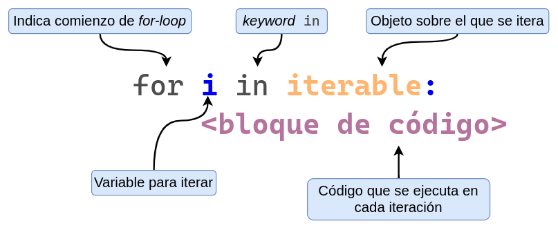
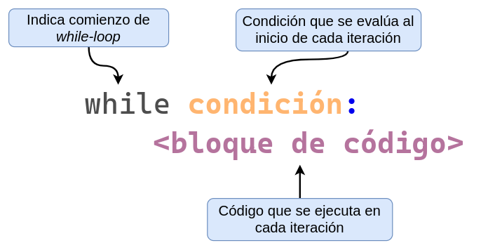
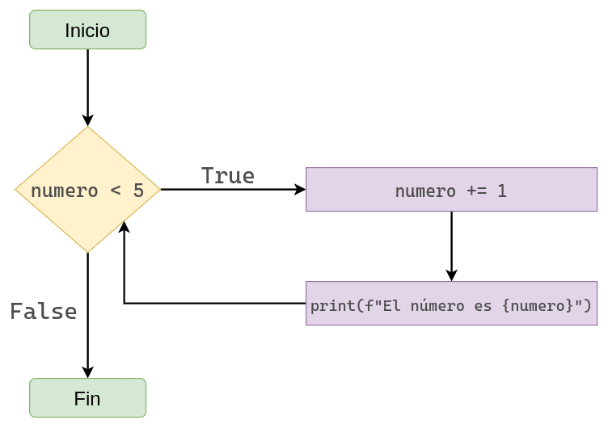

## Introducción

Anteriormente aprendimos a crear objetos que contienen otros objetos (listas, tuplas y diccionarios).

Cuando queríamos realizar una acción con cada uno de los objetos que estos contenían, teníamos que escribir el mismo código para acceder a cada uno de ellos de a uno.

Por ejemplo, supongamos que tenemos un listado con nombres de nuestros amigos y queremos ponerlos a todos en mayúsculas:

```python
nombres = ["julieta", "facundo", "emiliano", "lorenzo", "victoria"]
print("Nombres originales:")
print(nombres)

nombres[0] = nombres[0].upper()
nombres[1] = nombres[1].upper()
nombres[2] = nombres[2].upper()
nombres[3] = nombres[3].upper()
nombres[4] = nombres[4].upper()

print("\nNombres modificados:")
print(nombres)
```

Vemos que realizamos **exactamente la misma acción** con cada nombre en la lista... ¿No estaría bueno poder automatizarlo?

Y para eso, en esta sección vamos a aprender sobre **bucles**.

## ¿Qué son los bucles?

Los bucles son una estrcutura de los lenguajes de programación que nos **permite repetir la ejecución de código de manera automática**.

En otras palabras, los bucles hacen que sea muy fácil ejecutar el mismo bloque de código una y otra vez.

A la repetición del mismo bloque de código una y otra vez le decimos **iteración**. Entonces, **los bucles nos ayudan a iterar**.

En Python tenemos **dos tipos de bucles**:

* El bucle `for` (_for-loop_).
* El bucle `while` (_while-loop_).

La diferencia entre este tipo de bucles es que con el `for` **conocemos la cantidad de iteraciones** que vamos a realizar de antemano.

En cambio, con el `while` **no conocemos la cantidad de iteraciones** que vamos a realizar de antemano.

Veamos el ejemplo anterior pero utilizando un bucle `for`. En este caso, generamos una nueva lista llamada `nombres_modificados` donde vamos a almacenar los nombres modificados.

```python
nombres = ["julieta", "facundo", "emiliano", "mariana", "victoria"]
nombres_modificados = []

# Bucle for
for nombre in nombres:
    nombres_modificados.append(nombre.upper())

print("Nombres originales:")
print(nombres)

print("\nNombres modificados:")
print(nombres_modificados)
```

## El bucle `for`

### Presentación

En un bucle `for` encontramos los siguientes componentes.

* La palabra clave `for`

* El nombre de una variable que se usa para iterar (variable de iteración)

* La palabra clave `in`

* El objeto sobre el cual iteramos, seguido por `:`

* En la siguiente linea y con indentación, el bloque de código a ejecutar

{fig-align="center" width="600px"}

En Python, al igual que en las sentencias `if`, `else` y otras estructuras de control, los dos puntos (`:`) se utilizan para indicar el comienzo de un bloque de código, y la indentación define el contenido de ese bloque. **Nunca** se emplean llaves `{}` como en otros lenguajes.

En el caso de un bucle `for`, se declara una variable que va tomando, en cada **iteración**, uno de los valores del **iterable** que se está recorriendo. Por ejemplo, si el iterable contiene **10 objetos**, el bucle ejecutará **10 iteraciones** y la **variable de iteración** (por convención llamada `i`, aunque puede tener cualquier nombre) irá adoptando esos valores, uno por uno.

### Ejemplos

Dado que a iterar se aprende iterando, veamos algunos ejemplos:

```python
for i in [3, 1, 2]:
    print(f"El número es {i}.")
```

También podemos ordenar los valores de la lista sobre la que iteramos:

```python
for i in sorted([3, 1, 2]):
    print(f"El número es {i}.")
```

Pero no es necesario iterar sobre listas. De hecho, podemos iterar sobre cualquier secuencia, por ejemplo, una tupla:

```python
for i in (3, 1, 2):
    print(f"El número es {i}.")
```

```python
for i in sorted((3, 1, 2)):
    print(f"El número es {i}.")
```

E incluso una cadena de caracteres:

```python
for c in "Hola Curso":
    print(c)
```

::: {.callout-warning}
##### Variable de iteración

El nombre de la variable que se usa para iterar es **arbitrario**. Sin embargo, es recomendable no utilizar el mismo nombre que el de otra variable en nuestro programa. Por ejemplo:

```python
i = 1
for i in [1, 2, 3]:
    print(i)
print(i)
```
```
1
2
3
3
```

La variable de iteración `i` va pisando su valor y cualquier valor que esta pudo haber tenido antes.

Así, luego de la finalizar el bucle, el valor de `i` es `3`.

:::

Los bucles permiten generar nuevos objetos de forma automática.

En el siguiente ejemplo, partimos de una lista con cadenas que pueden contener números o letras.
Mediante un `for`, crearemos tres listas: una con los números, otra con el texto y una tercera con los elementos que no sean ninguno de los dos.

```python
lista_original = ["1", "@", "x", "y", "?", "3", "4", "7", "f", "l", "9", "10", "!"]
```

```python
# Crear tres listas vacías (que contienen los diferentes tipos de datos)
numeros = []
texto = []
otros = []

# Iterar a traves de los valores de la lista original
for valor in lista_original:
    # Si es numérico, lo agregamos en la lista 'numeros'
    if valor.isnumeric():
        numeros.append(valor)
    # Sino es numérico, pregunto si es alfabético (o una letra del abecedario)
    elif valor.isalpha():
        texto.append(valor)
    # Caso contrario, lo metemos en la lista de otros
    else:
        print(f"La cadena '{valor}' no es ni numérica ni alfabética.")
        otros.append(valor)

print(lista_original)
print(numeros)
print(texto)
print(otros)
```

### Crear listas numéricas con `range()`.

Python provee una función llamada `range()` que hace que sea muy fácil generar una secuencia de números. Por ejemplo, podemos usar `range()` para imprimir una serie de números.

```python
for i in range(1, 5):
    print(i)
```

`range()` funciona de manera similar a los _slices_, es decir, no incluye el límite superior. Además, si se usa con un solo argumento, es equivalente a `range(0, numero)`.

```python
for i in range(5):
    print(i)
```

Una forma útil de entender `range(n)` es verlo como la creación de una secuencia con los primeros `n` números, comenzando desde 0.

```python
x = range(5)
print(x)
print(type(x))
```

Podemos obtener una lista a partir de un `range` usando la función `list()`.

```python
list(x)
```

Y, por qué no, una tupla también.

```python
tuple(x)
```

`range()` admite un tercer argumento opcional que especifica el paso entre valores. Por defecto es `1`. Veamos algunos ejemplos:

Lista de números entre 0 y 10 (no inclusivo), avanzando de a 2 en cada paso.

```python
list(range(0, 10, 2))
```

Intento de lista de números entre 10 y 0 (no inclusivo).

```python
list(range(10, 0))
```

Vemos que el resultado no es el esperado. Esto se debe a que el paso es por defecto `1` y es imposible recorrer desde el 10 al 0 sumando de a 1.
Si cambiamos el paso a `-1`, funciona correctamente:

```python
list(range(10, 0, -1))
```

### ¿Sobre qué cosas podemos iterar en un bucle `for`?

Recordemos el diagrama que vimos anteriormente...

{fig-align="center" width="600px"}

En naranja tenemos resaltado **iterable**. Pero, ¿qué significa que un objeto sea iterable?

* Que podemos iterar a través de el.
* Que podemos recorrerlo elemento por elemento.
* Que puede devolver sus elementos de a uno a la vez.

De manera similar a las secuencias, el término iterable describe una categoría de tipos de datos. De hecho, todas las secuencias son iterables (por eso podemos recorrer listas, tuplas y cadenas), pero no es requisito ser una secuencia para ser iterable. Por ejemplo, los diccionarios no son secuencias y, sin embargo, pueden recorrerse porque implementan un método para entregar sus elementos de uno en uno.

```python
for i in {"a": 1, "b": 2}:
    print(i)
```

## El bucle `while`

En un bucle `while` encontramos los siguientes componentes.

* La palabra clave `while`.

* Una condición, es decir, una expresión que se evalúa a `True` o `False`, seguido por los dos puntos `:`.

* En la siguiente linea y con indentación, el bloque de código a ejecutar.

{fig-align="center" width="600px"}

```python
numero = 0
while numero < 5:
    numero += 1 # Abreviación de x = x + 1
    print(f"El numero es {numero}")
```

{fig-align="center" width="600px"}

Analicemos el diagrama:

* Mientras `numero < 5` sea `True`, Python ejecutará el cuerpo del bucle completo.
* En la primera iteración, `numero` es 0.
    - Como 0 es menor a 5, Python imprime el número y luego le agrega 1, haciendo que el número sea 1.
* En la segunda iteración, `numero` es 1.
    - Como 1 es menor a 5, Python imprime el número y luego le agrega 1, haciendo que el número sea 2.

El proceso continúa hasta que `numero` deja de ser menor que 5, momento en el que el bucle se detiene.

::: {.callout-warning}
##### Bucles infinitos ♾️

Veamos el siguiente ejemplo:

```python
x = 0
while x < 5:
    print(x)
```

Si ejecutamos este código, Python **nunca** detendrá su ejecución. Esto sucede porque el valor de `x` nunca cambia, por lo que la condición `x < 5` es siempre verdadera.
Este es un caso típico de **bucle infinito**, algo que puede ocurrir con cualquier `while`, y en particular con `while True` si no incluimos una forma de salir del bucle (por ejemplo, con `break`).

Si entramos en un bucle infinito,  la única forma de detenerlo es interrumpir la ejecución manualmente:

* En la terminal: `CTRL + C`
* En un editor de código: usar el botón de interrupción
:::

### La sentencia `break`

Python provee la sentencia `break` que sirve para terminar un bucle (_for_ o _while_) de manera anticipada. 

Veamos algunos ejemplos de uso.

```python
while True:
    print("¡Hola!")
    break
```

En el ejemplo anterior, la condición del bucle era `True`, lo que implicaría una ejecución infinita.
Sin embargo, al final de la primera iteración encontramos un `break`, que fuerza la salida del bucle.
De forma similar, podemos reescribir el primer `while` utilizando esta estructura alternativa.

```python
numero = 0
while True:
    if numero >= 5:
        break
    numero += 1
    print(f"El numero es {numero}")
```

```python
numero = 0
while True:
    numero += 1
    print(f"El numero es {numero}")
    if numero >= 5:
        break
```

Supongamos que queremos sumar los valores de una lista hasta que se cumpla cierta condición, por ejemplo, que el total sea mayor o igual a 20.

Si partimos de una lista de números cualquiera, no sabemos de antemano cuántos elementos será necesario sumar. Sin embargo, esto no será un problema si utilizamos la estructura `while` en combinación con la sentencia `break`.

```python
suma = 0
umbral = 20
valores = [3, 5, 4, 4, 5, 5, 3, 5, 2, 7]

while valores:
    suma += valores.pop(0)
    print(suma)
    if suma >= umbral:
        break
```

```python
valores # valores que no se sumaron
```

En el bloque de código anterior puede llamar la atención el uso de

```python
while valores:
```

El bucle `while valores`: se ejecuta mientras la lista tenga elementos. En cada iteración, `.pop(0)` extrae el primer elemento, se suma a `suma` y se imprime el total acumulado. Si en algún momento `suma` alcanza o supera el umbral, se ejecuta `break` para detener el bucle aunque aún queden elementos en la lista. Si la lista se vacía antes de llegar al umbral, el bucle también finaliza automáticamente gracias a la condición `while valores:`.

Un ejemplo más conciso es el siguiente:

```python
if [1, 2, 3]:
    print("Bloque 'if'")
else:
    print("Bloque 'else'")
```

```python
if []:
    print("Bloque 'if'")
else:
    print("Bloque 'else'")
```

Ahora supongamos que tenemos una lista de números aleatorios que representan algún conteo.

Estamos interesados en la cantidad de extracciones que se necesitaron hasta que el conteo supere cierto umbral, por ejemplo, 30.

```python
numeros_aleatorios = [
    5, 7, 6, 4, 2, 2, 5, 3, 6, 4, 4, 6, 3, 6, 1,
    3, 3, 1, 9, 5, 5, 6, 5, 1, 7, 3, 3, 1, 3, 4
]

umbral = 30

# Inicializamos suma y cantidad de iteraciones en 0
suma = 0
iteraciones = 0

# Mientras la lista no esté vacía
while numeros_aleatorios:
    # Agregamos 1 al conteo de iteraciones realizadas
    iteraciones += 1

    # Extraemos el primer número de la lista y lo sumamos a la suma
    suma += numeros_aleatorios.pop(0)

    # Si la suma es mayor o igual al umbral, dejamos de iterar
    if suma >= umbral:
        break

if suma >= umbral:
    print(f"Se superó el umbral de {umbral} en la iteración {iteraciones}, sumando {suma}.")
else:
    print(f"La suma de los elementos de la lista no llega a superar {umbral}")
```

#### Solicitar valores de entrada al usuario

Python provee una función llamada `input()` que sirve para solicitar al usuario que ingrese un valor. 

* El argumento es el mensaje que se mostrará en pantalla.
* El tipo de dato que se devuelve es `str`.

```python
nombre = input("Ingresa tu nombre: ")
print(f"El nombre ingresado es '{nombre}'")
```

Esta funcion combinada con el bucle `while` nos permite generar programas interactivos que solicitan entrada al usuario hasta que se cumple una condición.
Por ejemplo, supongamos que queremos solicitar una contraseña que tenga 8 caracteres o más.

```python
while True:
    pwd = input("Ingrese su contraseña: ")
    if len(pwd) >= 8:
        print("¡Muchas gracias!")
        break
    else:
        print(f"La contraseña '{pwd}' es corta")
print(f"La contraseña ingresada es '{pwd}'")
```

### La sentencia `continue`

Así como tenemos la sentencia `break` que le dice a Python que interrumpa la ejecución de un bucle, tenemos la sentencia `continue` que le dice que pase a la siguiente iteración **sin ejecutar el código a continuación de la misma**.

Cuando un programa se encuentra con `continue` se procede a la siguiente iteración del bucle, re-evaluando la condición del `while` de ser necesario.

En el siguiente ejemplo tenemos una lista con números del 1 al 10 y queremos sumar solamente los números pares.

```python
# Crear lista del 1 al 10
numeros = list(range(1, 11))
print(numeros)

suma = 0
while numeros:
    numero = numeros.pop(0)
    if numero % 2 != 0:
        continue
    suma += numero
    print("Sumando el numero", numero)

print("La suma es", suma)
```

En este programa, si `numero % 2 != 0`, el `continue` le indica a Python que debe pasar a la siguiente iteración sin evaluar lo que hay debajo. Por lo tanto, cuando el número es impar, no se ejecuta ni la suma ni el `print`.

Este problema se puede resolver también utilizando un bucle `for` en vez de un bucle `while`.

```python
numeros = list(range(1, 11))
suma = 0
for numero in numeros:
    if numero % 2 != 0:
        continue
    suma += numero
    print("Sumando el numero", numero)
print("La suma es", suma)
```

## Conclusión

Cuándo usar un bucle `for`.

* Sabemos exactamente, y de antemano, cuantas veces queremos iterar.
* Queremos iterar a través de todos los elementos de un objeto determinado.

Cuándo usar un bucle `while`.

* No sabemos exactamente cuantas veces queremos iterar.
* Queremos iterar hasta que se cumpla (o se deje de cumplir) una condición determinada.

