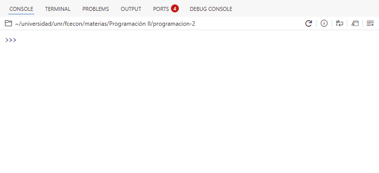
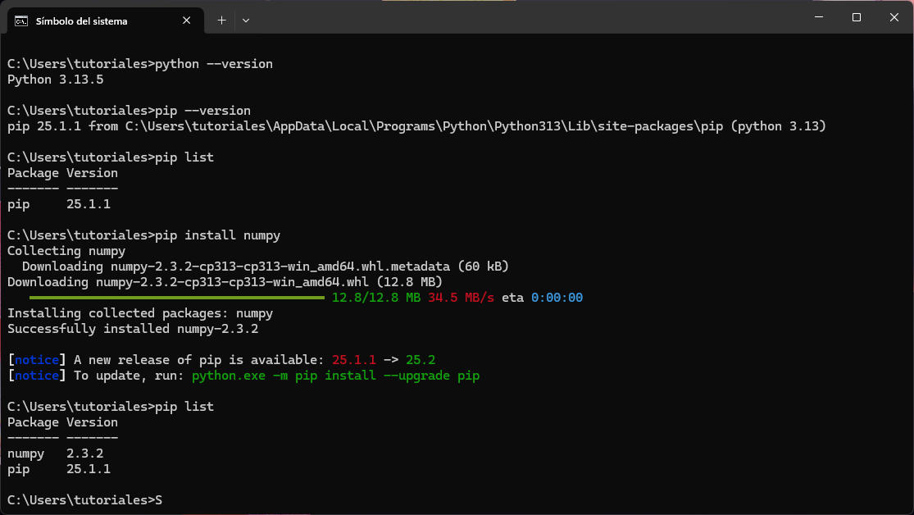

## Introducción

En la mayoría de los proyectos de programación no alcanza con el código que escribimos nosotros mismos.
Con frecuencia necesitamos utilizar código externo y/o de terceros, ya sea para resolver problemas comunes de manera más rápida o para aprovechar el trabajo de la comunidad.

Python facilita este proceso a través de módulos y paquetes, que nos permiten organizar, compartir e integrar código de forma sencilla.
Gracias a ellos podemos sumar nuevas funcionalidades sin tener que programar todo desde cero, mantener el código más ordenado y evitar errores innecesarios.

## Módulos y paquetes

Un **módulo** es un archivo de Python (por ejemplo, `modulo.py`) que contiene código que se puede reutilizar.
En general, los módulos definen funciones, clases y objetos que representan datos de distinta complejidad.
Estos pueden ir desde estructuras simples, como una constante numérica, hasta otras más elaboradas, como una tabla de datos con columnas de diferentes tipos.

Un **paquete**, por otro lado, es una **colección de módulos**, generalmente interdependientes.
En la práctica, un paquete es una carpeta que contiene varios módulos e, incluso, subpaquetes (carpetas con módulos).
Por lo general, los paquetes ofrecen un conjunto de herramientas más amplio que un módulo individual.
Además, suelen distribuirse de forma que puedan ser instalados y utilizados por otros usuarios.

### Por qué existen

Así como las funciones ayudan a reutilizar un programa sin repetir el código y los bucles permiten repetir la misma acción muchas veces, los módulos y paquetes también permiten la **reutilización de código**.

De este modo se evita, por ejemplo, tener que crear una función cada vez que la queremos usar. Simplemente la importamos o la "traemos" de un módulo o paquete. Se ahorra tiempo, se reduce la probabilidad de errores y se mejora la mantenibilidad del código.

Además, los paquetes y módulos nos ayudan a mantener el código organizado y modular.
Al dividir el código en "partes" más pequeñas y manejables, facilitamos su comprensión y mantenimiento.

Por último pero no menos importante, los módulos paquetes nos permiten **aprovechar el trabajo de otros**. De esta manera, podemos hacer mucho más sin tener que programar todo desde cero.

::: {.callout-note}
##### Glosario 🎯

La documentación de Python 3 provee [un glosario](https://docs.python.org/3/glossary.html) con definiciones precisas para términos relevantes en el universo de Python.
Entre ellas, podemos destacar las de módulo y paquete:

* **Módulo**: Un objeto que funciona como una unidad de organización de código de Python.
Los módulos tienen un **espacio de nombres** (_namespace_) que contiene objetos de Python arbitrarios.
Los módulos se cargan en Python a través del proceso de **importación**.
* **Paquete**: Un **módulo** de Python que puede contener submódulos o, de forma recursiva, subpaquetes.
Técnicamente, un paquete es un módulo de Python con un atributo `__path__`.

:::

## Cómo importar código

### La sentencia `import`

Para importar un módulo usamos la sentencia `import` seguida del nombre del módulo a importar.

```python
>>> import nombre
```

De esta manera, podemos importar el módulo `math` que pertenece a la librería estándar de Python.

```python
>>> import math
```

Luego, podemos acceder a los objetos **dentro del _namespace_** `math` utilizando `math.nombre_objeto`. Por ejemplo, para usar la función `sqrt()`, que calcula la raíz cuadrada de un numero `n`, escribimos `math.sqrt(n)`.

```python
>>> math.sqrt(16)
4.0
```

Si quisiéramos importar más de una módulo, solo tenemos que agregar una nueva línea con el `import` correspondiente. Así, podemos también importar el módulo `random` que provee herramientas para generar números aleatorios.

```python
>>> import math
>>> import random
```

```python
>>> random.random() # número aleatorio entre 0 y 1
0.7934917548608393
```

::: {.callout-note}
##### Librería estándar de Python 📚

La librería estándar de Python es un conjunto de módulos y paquetes incluidos por defecto con cualquier instalación oficial de Python, listos para usar sin necesidad de hacer instalaciones adicionales.

:::

::: {.callout-note}
##### Diferencias con R 🎭

A diferencia de la carga de paquetes en R, que pone a disposición objetos del paquete en el ambiente global, el comando `import math` en Python no carga los objetos del módulo `math` directamente en el ambiente donde se ejecuta; solo carga el módulo en sí.

Para acceder a las funciones de `math`, es necesario hacerlo mediante el nombre del módulo.
Por este motivo, el siguiente bloque de código produce un error:

```python
>>> import math
>>> sqrt(16)
```

:::{.code-error}
```python
NameError: name 'sqrt' is not defined
```
:::

:::

### Listar nombres disponibles

Para obtener un listado con los nombres de los objetos disponibles dentro de un módulo, podemos usar la función `dir()`.

```python
>>> dir(math)
['__doc__',
 '__file__',
 '__loader__',
 '__name__',
 '__package__',
 '__spec__',
 'acos',
 'acosh',
 'asin',
 'asinh',
...
 'tan',
 'tanh',
 'tau',
 'trunc',
 'ulp']
```

Sin embargo, en la práctica, esta función no suele usarse demasiado para explorar los nombres disponibles en un módulo.

Por lo general, trabajamos en editores de código que muestran automáticamente la lista de variables disponibles en un módulo.

En Positron, si escribimos `math` seguido de un punto (`math.`), el editor desplegará un listado de los objetos disponibles en dicho módulo.

{fig-align="center"}

### Importar objetos de un módulo

La flexibilidad en la carga de módulos en Python permite importar uno o más objetos de un módulo (o submódulo) sin necesidad de importar el módulo completo.

La sintaxis para traer un `objeto` de un módulo llamado `cosas` es:

```python
>>> from cosas import objeto
```

De este modo, podemos cargar la constante `pi` del módulo `math`.

```python
>>> from math import pi
```

Luego, es posible acceder a la variable `pi` sin tener que pasar por el nombre del módulo donde se define.

```python
>>> pi
3.141592653589793
```

En nuestro caso, como anteriormente también importamos el módulo `math`, seguimos teniendo acceso a `pi` a través de `math`.

```python
>>> print(math.pi)
>>> print(pi)
3.141592653589793
3.141592653589793
```

Para importar varios objetos a la vez, se utiliza una sintaxis similar a la anterior, separando sus nombres con comas. A modo de ejemplo, importemos las funciones `mean()` y `median()` de otro módulo estándar llamado `statistics`.

```python
>>> from statistics import mean, median
```

```python
>>> numeros = [4, 5, 9, 30, 3, 8, 6]

>>> print("La media es:", mean(numeros))
>>> print("La mediana es:", median(numeros))
La media es: 9.285714285714286
La mediana es: 6
```

### Importar con alias

Python no solo permite decidir que objetos importar de un módulo, si no que también hace posible asignar un alias al objeto o módulo que se importa.

Para un módulo:

```python
>>> import modulo as alias
```

Y para un objeto dentro de un módulo:

```python
>>> from modulo import objeto as alias
```

Podemos importar el módulo `math` usando el alias `mates`:

```python
>>> import math as mates

>>> print(mates.cos(mates.pi)) # coseno(pi)
-1.0
```

O importar la funcion `sqrt` con el nombre `raiz`:

```python
>>> from math import sqrt as raiz

>>> raiz(81)
9.0
```

::: {.callout-warning}

##### El problema de importar todo

Python permite cargar todos los objetos definidos en un módulo o paquete directamente en el ambiente actual. La sintaxis es:

```python
>>> from nombre import *
```

Esta **no es una práctica recomendable**, ya que no sabemos cuántos elementos se importarán ni qué conflictos podrían surgir entre los nombres definidos en el módulo y los que ya tenemos en nuestro programa.

El uso de `from nombre import *` produce un efecto similar al de `library(paquete)` en R, pero en Python se desaconseja.

:::

## Módulos propios

La sintaxis para importar un módulo propio, u objetos definidos en él, es la misma que la que se utiliza para importar cualquier otro módulo.

Supongamos que tenemos un archivo llamado `funciones.py` con el siguiente contenido:

```{.python filename="funciones.py"}
def es_par(n):
    if n % 2 == 0:
        return True
    return False


def es_primo(n):
    if n <= 1:
        return False

    for i in range(2, n):
        if n % i == 0:
            return False

    return True
```

y queremos usar las funciones `es_par` y `es_primo` en nuestro programa principal.

Un aspecto fundamental a tener en cuenta para poder importar el módulo `funciones` desde nuestro programa principal es su ubicación.

Si el archivo `funciones.py` no se encuentra en alguno de los directorios que Python recorre al ejecutar la sentencia `import`, obtendremos un error.

Uno de los directorios en los que Python busca módulos al importar es el directorio actual, es decir, aquel desde donde se ejecuta nuestro programa principal.

Supongamos una carpeta (es decir, un proyecto) con la siguiente estructura de archivos:

```cmd
proyecto/                  # Carpeta
├── funciones.py           # Módulo
└── programa.py            # Programa principal
```

Aquí, `programa.py` es nuestro programa principal y contiene el siguiente código:

```python
>>> import funciones

>>> print(funciones.es_par(12))
>>> print(funciones.es_par(15))

>>> print(funciones.es_primo(1))
>>> print(funciones.es_primo(11))
>>> print(funciones.es_primo(15))
True
False
False
True
False
```

Al ejecutarlo, se obtiene la salida que se muestra en el mismo bloque.

Un programa equivalente es el siguiente:

```python
>>> from funciones import es_par, es_primo

>>> print(es_par(12))
>>> print(es_par(15))

>>> print(es_primo(1))
>>> print(es_primo(11))
>>> print(es_primo(15))
True
False
False
True
False
```

La salida de este programa será la misma que la del ejemplo anterior.
La diferencia es que en este segundo programa se importan directamente las funciones `es_par` y `es_primo` desde el módulo `funciones`,
en lugar de importar el módulo y luego acceder a las funciones a través de `funciones.es_par` y `funciones.es_primo`.

## Paquetes externos

La instalación de paquetes en Python se realiza mediante un **sistema de gestión de paquetes** que se encarga de instalar y administrar paquetes.

Estos paquetes se encuentran alojados en repositorios públicos (o privados) a los que los gestores acceden para descargar y actualizar el software.

En el ecosistema de Python existe una gran variedad de sistemas de gestión de paquetes, cuya adopción depende de las necesidades de cada usuario o proyecto.

En cuanto a los repositorios, también hay varias alternativas. Sin embargo, a diferencia de los gestores, el **_Python Package Index_ (PyPI)** es el más utilizado por la gran mayoría de la comunidad.

::: {.callout-note}
##### Nota 📝

Se puede considerar al _Python Package Index_ (PyPI) como el equivalente del _Comprehensive R Archive Network_ (CRAN) en el ecosistema de R.

:::

### Instalación de paquetes con `pip`

La instalación oficial de Python incluye un administrador de paquetes estándar llamado `pip`.
Esta herramienta permite instalar y gestionar paquetes que no forman parte de la biblioteca estándar de Python.

Es importante resaltar que `pip` se utiliza desde la terminal, no desde el intérprete de Python.

En Windows, es posible usar el comando `where pip` para localizar la ubicación del programa.
Otra opción es ejecutar `pip --version`, que muestra la versión instalada de `pip` junto con la ruta de la instalación de Python a la que está vinculado.

Antes de instalar paquetes con `pip`, es posible consultar qué paquetes ya se encuentran instalados mediante esta herramienta con el comando `list`:

```cmd
pip list
```

Este comando muestra un listado con los paquetes instalados y sus respectivas versiones.

```cmd
C:\Users\tutoriales>pip list
Package Version
------- -------
pip     25.1.1
```

Como aún no hemos instalado ningún paquete adicional a los que vienen con Python, solo se muestra `pip`.

La instalación de paquetes se hace con el comando `install`. Luego, para instalar el paquete NumPy hacemos:

```cmd
pip install numpy
```

Debajo se incluye una captura de la terminal de Windows donde se muestra la ejecución de los comandos antes mencionados y sus respectivas salidas:

{fig-align="center"}

::: {.callout-note}
##### Ejecutar `pip` como módulo de Python

La herramienta `pip` es simplemente un módulo de Python.
Si tenemos múltiples instalaciones de Python y/o `pip`, es posible que la versión de `pip` a la que se accede en nuestra terminal no sea la que está asociada a la versión de Python que queremos utilizar. 
Para evitar este tipo de problemas, se puede ejecutar el programa `pip` como un módulo de Python. De este modo, la instalación de NumPy se vería de la siguiente manera:

```cmd
python -m pip install numpy
```

La opción `-m` le indica a Python que ejecute un módulo como si fuera un programa dentro del intérprete de Python.

:::

::: {.callout-note}
##### ¿En qué momento seleccionamos a PyPI? 🤔

No es necesario que manualmente selccionemos a PyPI como repositorio de código. Por defecto, `pip` ya instala los paquetes desde PyPI.

:::

### Creación de ambientes con `venv`

Cuando instalamos paquetes con la versión de `pip` que se incluye por defecto en Python, estos se instalan de forma **global**.
Esto no siempre representa un problema, pero suele complicarse cuando trabajamos en varios proyectos distintos.

Cada proyecto puede depender de diferentes paquetes, e incluso de diferentes versiones de Python.
Si todos comparten una misma instalación global, es muy probable que aparezcan conflictos: algunos programas podrían dejar de funcionar o comportarse de manera incorrecta.

Una solución sería reinstalar todas las dependencias desde cero cada vez, pero esto implica una pérdida de tiempo innecesaria y, además, no garantiza el correcto funcionamiento. La solución más aceptada por la comunidad es usar **ambientes virtuales**.

Un ambiente virtual en Python permite aislar dependencias y paquetes para evitar conflictos entre proyectos.

Existen distintas herramientas para crear y administrar ambientes virtuales; la que se incluye en la instalación oficial de Python es **`venv`**.

Para crear un ambiente virtual con `venv`, primero debemos ubicarnos en la carpeta de nuestro proyecto y ejecutar en la terminal:

```cmd
python -m venv .venv
```

El nombre **`.venv`** es una convención adoptada por la comunidad, aunque puede usarse cualquier nombre válido de directorio.

Este comando genera una carpeta con la siguiente estructura:

```cmd
.venv
├── Include
├── Lib
│   └── site-packages
│       ├── pip
│       └── pip-25.1.1.dist-info
├── Scripts
│   ├── Activate.ps1
│   ├── activate
│   ├── activate.bat
│   ├── activate.fish
│   ├── deactivate.bat
│   ├── pip.exe
│   ├── pip3.13.exe
│   ├── pip3.exe
│   ├── python.exe
│   └── pythonw.exe
└── pyvenv.cfg
```

Dentro de `.venv/Lib/site-packages` se almacenan los paquetes instalados en el ambiente, y en `.venv/Scripts` se encuentra el ejecutable de Python (`python.exe`) junto con otros _scripts_ de utilidad.

Para usar el intérprete de Python del ambiente e instalar paquetes en él, es necesario **activarlo** con el comando:

```cmd
.venv\Scripts\activate
```

Al hacerlo, se mostrará `(.venv)` al inicio de la línea de la terminal.

Finalmente, para **desactivar el ambiente**, basta con ejecutar:

```cmd
deactivate
```

### Ejemplo: NumPy

[NumPy](https://numpy.org/) es una paquete de Python especializado en el cálculo numérico y el análisis de datos.

Provee un nuevo tipo de objeto llamado `array` que permite representar colecciones de datos de un mismo tipo en varias dimensiones y funciones muy eficientes para su manipulación.

{width="400px" fig-align="center"}

Para crear un proyecto, un ambiente con `venv` e instalar NumPy, seguimos los siguientes pasos:

```cmd
mkdir proyecto          # Crear directorio
cd proyecto             # Mover la terminal al directorio del proyecto
python -m venv .venv    # Crear ambiente virtual llamado .venv
.venv\Scripts\activate  # Activar ambiente
pip install numpy       # Instalar numpy en el ambiente del proyecto
python                  # Iniciar el intérprete interactivo de Python
```

El siguiente video muestra los pasos realizados en la terminal de Windows:

<center>
<video controls width="700" preload="metadata" style="border-radius: 8px; max-width: 100%;">
  <source src="imgs/venv_numpy.webm" type="video/webm" />
</video>
</center>

Los paquetes de Python suelen importarse utilizando un alias. En el caso de los más populares, como NumPy, la mayoría de la comunidad usa el alias **`np`**.

```python
>>> import numpy as np

>>> array = np.array([1, 2, 3, 4])
>>> array
array([1, 2, 3, 4])
```

```python
>>> type(array)
<class 'numpy.ndarray'>
```

La propiedad `.ndim` nos devuelve el número de dimensiones del array.

```python
>>> array.ndim
1
```

Y `.shape` nos devuelve la "forma" del array. Es decir, la cantidad de elementos por cada dimensión. Se puede notar que el `.shape` de un _array_ es una tupla.

```python
>>> array.shape
(4,)
```

En este caso creamos un _array_ a partir de una lista, pero también es posible crear _arrays_ a partir de otros objetos.

Si continuamos utilizando listas, el número de dimensiones del _array_ va a depender del anidamiento que tengamos en las listas que utilizamos.

A modo de ejemplo, podemos crear un _array_ de dos dimensiones de la siguiente manera:

```python
>>> array_2d = np.array([[1, 2, 3, 4], [5, 6, 7, 8]])
>>> array_2d
array([[1, 2, 3, 4],
       [5, 6, 7, 8]])
```

```python
>>> print(array_2d.ndim)
>>> print(array_2d.shape)
2
(2, 4)
```

Una de las características más atractivas de NumPy es que las operaciones matemáticas con `array`s están vectorizadas, es decir, se realizan al nivel del arreglo.

```python
>>> print(array * 10)
>>> print(array - 5)
>>> print(array / 10)
>>> print(array ** 2.4)
[10 20 30 40]
[-4 -3 -2 -1]
[0.1 0.2 0.3 0.4]
[ 1.          5.27803164 13.96661017 27.85761803]
```

NumPy también provee **muchísimas funciones** para hacer cálculos comúnmente realizados con los _arrays_.

```python
>>> print(np.mean(array))
>>> print(np.median(array))
>>> print(np.std(array))
>>> print(np.exp(array))
2.5
2.5
1.118033988749895
[ 2.71828183  7.3890561  20.08553692 54.59815003]
```

## Apéndice

### Algunos comandos de `pip`

| Comando                                                  | Descripción                                                                                         |
| -------------------------------------------------------- | --------------------------------------------------------------------------------------------------- |
| `pip install pkg1 pkg2`                                  | Instala uno o varios paquetes.                                                                      |
| `pip install pkg==1.2.3`<br>`pip install pkg>=1.0,<=2.0` | Instala una versión específica o un rango de versiones de un paquete.                               |
| `pip install pkg --upgrade`                              | Actualiza un paquete a la última versión disponible.                                                |
| `pip freeze`                                             | Muestra todos los paquetes instalados y sus versiones en formato compatible con `requirements.txt`. |
| `pip uninstall pkg`                                      | Desinstala un paquete instalado.                                                                    |
| `pip show pkg`                                           | Muestra información detallada sobre un paquete (versión, ubicación, dependencias).                  |
| `pip help`                                               | Muestra la ayuda general de `pip` o de un subcomando específico.                                    |
| `pip install -r dependencias.txt`                        | Instala todas las dependencias listadas en un archivo.                                              |

#### Ejemplos

```cmd
pip install requests flask        # Instala varios paquetes
pip install numpy==1.25.0         # Instala una versión exacta
pip install pandas>=1.0,<2.0      # Instala dentro de un rango de versiones
pip install requests --upgrade    # Actualiza un paquete
pip freeze                        # Lista paquetes instalados y versiones
pip uninstall flask               # Desinstala un paquete
pip show numpy                    # Muestra información de un paquete
pip help install                  # Muestra ayuda sobre 'install'
pip install -r requirements.txt   # Instala dependencias desde un archivo
```
