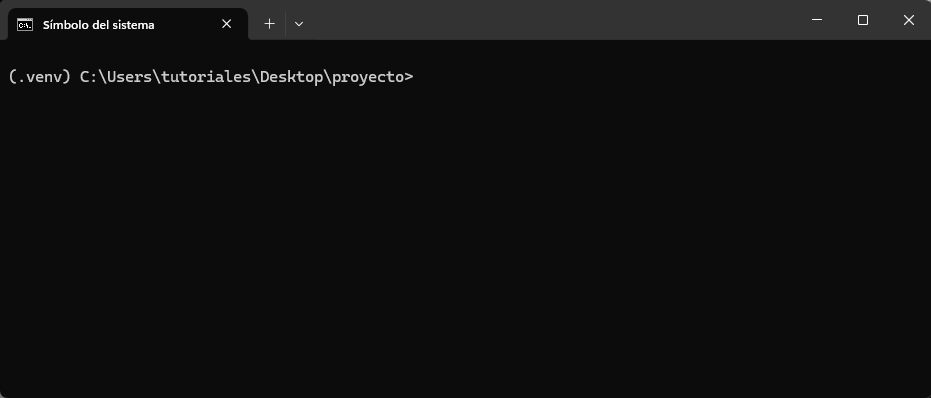

## ¿Qué es un _script_?

En programación, un **_script_** es un archivo de texto que contiene una secuencia lógica de pasos que se pueden ejecutar para realizar una tarea específica, ya sea simple o compleja.
Esta serie de pasos suele expresarse en un lenguaje de _scripting_, un lenguaje de programación que permite manipular, personalizar y automatizar tareas.

A diferencia de los programas compilados, los _scripts_ suelen **interpretarse en tiempo de ejecución**.
Es decir, un intérprete se encarga de leer, procesar y ejecutar cada instrucción en orden.

En el caso de **Python**, un _script_ es un archivo con extensión `.py` que puede automatizar procesos, analizar datos, crear aplicaciones o prácticamente cualquier otra tarea que el lenguaje permita.
El intérprete de Python ejecuta el código línea por línea, lo que facilita probar, modificar y reutilizar el programa de manera ágil

Debido a su uso frecuente para desarrollar _scripts_, Python es conocido también como un **lenguaje de _scripting_**, aunque en la práctica su uso sea mucho más amplio.

## _Script_ vs módulo

Python es un lenguaje de programación interpretado, y por ello sus programas suelen denominarse _scripts_.
Sin embargo, no siempre es correcto usar este término. Si bien muchos programas en Python consisten en instrucciones destinadas a resolver tareas puntuales, otros programas tienen por objetivo principal implementar herramientas que luego van a ser utilizadas por otros programas.

Un programa de Python puede denominarse _script_ o módulo. El propósito del código en un archivo de texto `.py` es lo que determina si lo llamamos de una manera o de la otra.
Cuando un archivo contiene código ejecutable cuyo fin es realizar una tarea específica, se lo considera _script_. En cambio, cuando el archivo está diseñado para ser importado y utilizado desde otro programa de Python, se lo denomina módulo.

En síntesis, la principal diferencia entre un módulo y un _script_ es que los módulos almacenan código importable mientras que los _scripts_ contienen código ejecutable.

## _Script_ y módulo

Python es un lenguaje tan flexible que un mismo programa puede funcionar como ***script*** y como **módulo** al mismo tiempo.
Esto ocurre cuando el archivo define herramientas reutilizables (por ejemplo, funciones o clases) y, además, incluye código que se ejecuta directamente al correrlo desde la línea de comandos.

Para ilustrarlo, consideremos un pequeño programa en Python que solicita una fecha al usuario y luego indica cuántos días faltan para llegar a ella:

```{.python filename="calcular_dias.py"}
from datetime import datetime

def diferencia_dias(fecha_str):
    fecha = datetime.strptime(fecha_str, "%Y-%m-%d").date()
    hoy = datetime.today().date()
    diferencia = (fecha - hoy).days
    return diferencia

fecha_str = input("Ingresá una fecha (formato AAAA-MM-DD): ")
diferencia = diferencia_dias(fecha_str)

if diferencia > 0:
    print(f"Faltan {diferencia} días para el {fecha_str}.")
elif diferencia == 0:
    print("¡La fecha es hoy!")
else:
    print(f"Esa fecha ya pasó hace {-diferencia} días.")
```

Debajo se muestra una animación de la ejecución de este _script_ en la terminal:

{fig-align="center"}

Ahora, supongamos que queremos importar la función `diferencia_dias` en otro programa de Python.

{fig-align="center"}

Cuando importamos una función del módulo `calcular_dias`, observamos que Python también ejecuta la parte del programa que solicita una fecha y muestra cuántos días faltan para alcanzarla.

Esto ocurre porque, al importar un módulo (o cualquier objeto definido en él), Python **ejecuta todo el código del archivo de principio a fin**, sin importar qué elementos en particular estemos importando.

Para evitar este comportamiento no deseado, y permitir que un mismo archivo pueda funcionar tanto como **módulo reutilizable** como **_script_ ejecutable**, se encapsula la parte que debe ejecutarse solo al correr el archivo directamente dentro del siguiente bloque:

```python
if __name__ == "__main__":
    # código ejecutable
```

Con esta estructura, el código dentro de ese bloque se ejecutará únicamente cuando el archivo se ejecute directamente como programa, y no cuando se lo importe desde otro módulo.

De esta manera, nuestro programa actualizado quedaría así:

```{.python filename="calcular_dias.py"}
from datetime import datetime

def diferencia_dias(fecha_str):
    fecha = datetime.strptime(fecha_str, "%Y-%m-%d").date()
    hoy = datetime.today().date()
    diferencia = (fecha - hoy).days
    return diferencia

if __name__ == "__main__":
    fecha_str = input("Ingresá una fecha (formato AAAA-MM-DD): ")
    diferencia = diferencia_dias(fecha_str)

    if diferencia > 0:
        print(f"Faltan {diferencia} días para el {fecha_str}.")
    elif diferencia == 0:
        print("¡La fecha es hoy!")
    else:
        print(f"Esa fecha ya pasó hace {-diferencia} días.")
```

Ahora, cuando se importa cualquier objeto desde `calcular_dias`, Python no ejecuta la parte del programa que interactúa con el usuario.

{fig-align="center"}

::: {.callout-note}
##### La variable especial `__name__` 🏷️

La variable `__name__` es una variable especial que indica el nombre del módulo actual.
Cuando un archivo Python se ejecuta directamente, `__name__` toma el valor `"__main__"`, lo que indica que es el módulo principal.
En cambio, si el archivo se importa como un módulo en otro _script_, `__name__` contendrá el nombre del archivo (sin la extensión .py).

:::

## CLIs con `argparse`

`argparse` es un módulo de la librería estándar de Python que sirve para crear interfaces de línea de comandos (CLIs, por sus siglas en inglés).

Con este módulo se pueden definir qué argumentos y opciones acepta nuestra programa. Luego, Python se encargará de:

* Leerlos desde la terminal al ejecutar el _script_.
* Convertirlos al tipo de dato indicado (`int`, `float`, `str`, etc.).
* Validarlos según las reglas definidas.
* Generar un mensaje de ayuda (`--help`) sin que tengamos que hacer nada.

### Ejemplo: saludos personalizados

El siguiente programa recibe el nombre de una persona como argumento obligatorio y, de manera opcional, la cantidad de veces que se la debe saludar.

```python
import argparse

parser = argparse.ArgumentParser(description="Saluda a una persona")
parser.add_argument("nombre", help="El nombre de la persona") # Argumento posicional
parser.add_argument("--veces", type=int, default=1, help="Cuántas veces saludar") # Argumento nombrado

args = parser.parse_args()

for _ in range(args.veces):
    print(f"¡Hola, {args.nombre}!")
```

Luego, en la terminal:


```cmd
python hola.py Tomás
¡Hola, Tomás!
```

Y si usamos el argumento `--veces`:

```cmd
python hola.py Tomás --veces 3
¡Hola, Tomás!
¡Hola, Tomás!
¡Hola, Tomás!
```

La ayuda se puede ver de la siguiente manera:

```cmd
python hola.py --help
usage: hola.py [-h] [--veces VECES] nombre

Saluda a una persona

positional arguments:
  nombre         El nombre de la persona

options:
  -h, --help     show this help message and exit
  --veces VECES  Cuántas veces saludar
```


Si usamos un valor de tipo erróneo para `--veces`, obtenemos un error informativo de manera automática:

```cmd
python hola.py Tomás --veces 3.5
```
:::{.code-error}
```cmd
usage: hola.py [-h] [--veces VECES] nombre
hola.py: error: argument --veces: invalid int value: '3.5'
```
:::

::: {.callout-note}
##### `input()` vs `argparse`

Tanto `input()` como `ArgumentParser` de `argparse` permiten pasar datos a nuestro _script_. La diferencia entre ellos es que `input()` se usa para pedir datos **mientras corre el programa**, mientras que el módulo `argparse` se usa apra pedir datos **al momento de ejecutar el programa** desde al terminal.

:::

